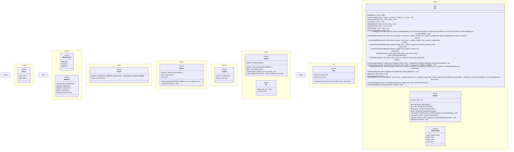

```mermaid
classDiagram
namespace config {
    class file {
        <<file>>
    }
}
namespace vector {
    class Basis {
        <<struct>>
        axis2: Vec4,
        axis3: Vec4,
    }
    class file {
        <<file>>
        +buildBasis(u: Vec4) Basis 
        +transformIntoBasis(u_in: Vec4, u_x: Vec4, u_y: Vec4, u_z: Vec4) Vec4 
        +createUnitVector(x: f64, y: f64, z: f64) Vec4 
        +normalize(u: Vec4) Vec4 
        +reflect(direction: Vec4, normal: Vec4) Vec4 
        +crossProduct(u: Vec4, v: Vec4) Vec4 
        +dotProduct(u: Vec4, v: Vec4) f64 
        +getMaxComponent(u: Vec4) f64 
    }
}
namespace main {
    class file {
        <<file>>
        +main() (std.mem.Allocator.Error || std.os.GetRandomError || std.Thread.CpuCountError || std.Thread.SpawnError || std.fs.File.OpenError || std.os.WriteError || error[TimedOut])!void 
    }
}
namespace material {
    class MaterialType {
        <<enum>>
        DIFFUSE,
        GLOSSY,
        MIRROR,
    }
    class Material {
        <<struct>>
        material_type: MaterialType,
        specular: vector.Vec4,
        emissive: vector.Vec4,
        diffuse: vector.Vec4,
        specular_exponent: f64,
    }
    class file {
        <<file>>
        +interreflectSpecular(normal: vector.Vec4, hit_point: vector.Vec4, x_sphere_sample: f64, y_sphere_sample: f64, specular_exponent: f64, cur_ray: ray.Ray) ray.Ray 
        +interreflectDiffuse(normal: vector.Vec4, hit_point: vector.Vec4, x_sphere_sample: f64, y_sphere_sample: f64) ray.Ray 
        +sampleHemisphereSpecular(x_sphere_sample: f64, y_sphere_sample: f64, specular_exponent: f64) vector.Vec4 
        +sampleHemisphereDiffuse(x_sphere_sample: f64, y_sphere_sample: f64) vector.Vec4 
    }
}
namespace tracer {
    class Tracer {
        <<struct>>
        samples: [config.NUM_SAMPLES_PER_PIXEL * config.NUM_SCREEN_DIMS]f64,
        scene: *scene.Scene,
    }
    class file {
        <<file>>
        +tracePaths(tracer: Tracer, pixels: []u8, offset: usize, size: usize) std.os.GetRandomError!void 
    }
}
namespace sphere {
    class Sphere {
        <<struct>>
        material: *const material.Material,
        center: vector.Vec4,
        radius: f64,
        +computeRaySphereHit(self: Sphere, cur_ray: ray.Ray) f64 
        +isLight(self: Sphere) bool 
    }
    class file {
        <<file>>
        +makeSphere(radius: f64, center: vector.Vec4, cur_material: *const material.Material) Sphere 
    }
}
namespace camera {
    class Camera {
        <<struct>>
        direction: vector.Vec4,
        field_of_view: f64,
    }
    class file {
        <<file>>
        +samplePixels(samples: *[config.NUM_SAMPLES_PER_PIXEL * config.NUM_SCREEN_DIMS]f64, rng: std.rand.Random) void 
        +applyTentFilter(samples: *[config.NUM_SAMPLES_PER_PIXEL * config.NUM_SCREEN_DIMS]f64) void 
    }
}
namespace scene {
    class Scene {
        <<struct>>
        spheres: std.ArrayList(sphere.Sphere),
        lights: std.ArrayList(usize),
        camera: *camera.Camera,
        +intersect(self: *Scene, cur_ray: ray.Ray) Hit 
        +collectLights(self: *Scene) std.mem.Allocator.Error!void 
    }
    class Hit {
        <<struct>>
        sphere_idx_opt: ?usize,
        ray_factor: f64,
    }
    class file {
        <<file>>
        +sampleLights(scene: *Scene, hit_point: vector.Vec4, normal: vector.Vec4, ray_direction: vector.Vec4, cur_material: *const material.Material) vector.Vec4 
    }
}
namespace image {
    class file {
        <<file>>
        +createImage(pixels: []const u8) (std.fs.File.OpenError || std.os.WriteError)!void 
        +getColor(u: vector.Vec4) Color 
        -getColorComponent(x: f64) u8 
    }
}
namespace ray {
    class Ray {
        <<struct>>
        direction: vector.Vec4,
        origin: vector.Vec4,
        +computeHitPoint(self: Ray, ray_factor: f64) vector.Vec4 
    }
    class file {
        <<file>>
        +tracePath(cur_ray: Ray, cur_scene: *scene.Scene, x_sphere_sample: f64, y_sphere_sample: f64, samples: [config.NUM_SAMPLES_PER_PIXEL * config.NUM_SCREEN_DIMS]f64, rng: std.rand.Random) vector.Vec4 
    }
}
namespace worker {
    class Worker {
        <<struct>>
        done: std.atomic.Atomic(bool),
        job_count: std.atomic.Atomic(u32),
        done_count: *std.atomic.Atomic(u32),
        queue: *std.atomic.Queue(WorkChunk),
        cur_job_count: u32,
        +launch(self: *Worker) (std.os.GetRandomError || error[TimedOut])!void 
        +wait(self: *Worker) error[TimedOut]!void 
        +put(self: *Worker, node: *std.atomic.Queue(WorkChunk).Node) void 
        +wake(self: *Worker) void 
    }
    class WorkChunk {
        <<struct>>
        tracer: *tracer.Tracer,
        buffer: *[]u8,
        offset: usize,
        size: usize,
    }
    class file {
        <<file>>
        +waitUntilDone(done_count: *std.atomic.Atomic(u32), target_count: u32) error[TimedOut]!void 
        +joinThread(thread: std.Thread, worker: *Worker) void 
    }
}
```
