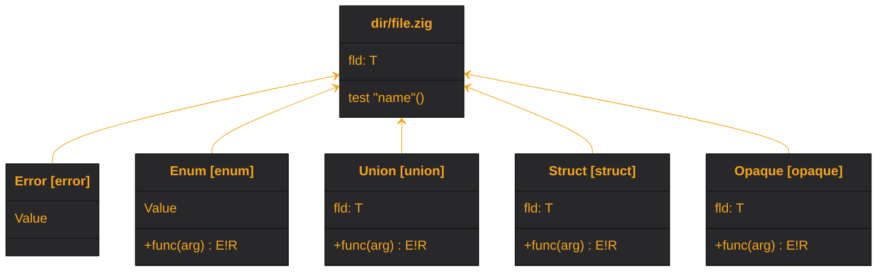

## :lizard: :mermaid: **meduza**

[![CI][ci-shield]][ci-url]
[![CD][cd-shield]][cd-url]
[![Meduza][mdz-shield]][mdz-url]
[![License][license-shield]][license-url]

### Zig codebase graph generator that emits a [Mermaid class diagram](https://mermaid.js.org/syntax/classDiagram.html).

#### :rocket: Usage

1. Add `meduza` as a dependency in your `build.zig.zon`.

    <details>

    <summary><code>build.zig.zon</code> example</summary>

    ```zig
    .{
        .name = "<name_of_your_package>",
        .version = "<version_of_your_package>",
        .dependencies = .{
            .meduza = .{
                .url = "https://github.com/tensorush/meduza/archive/<git_tag_or_commit_hash>.tar.gz",
                .hash = "<package_hash>",
            },
        },
    }
    ```

    Set `<package_hash>` to `12200000000000000000000000000000000000000000000000000000000000000000`, and Zig will provide the correct found value in an error message.

    </details>

2. Add `meduza` as a module in your `build.zig`.

    <details>

    <summary><code>build.zig</code> example</summary>

    ```zig
    const meduza = b.dependency("meduza", .{});
    exe.addModule("meduza", meduza.module("meduza"));
    ```

    </details>

#### :sparkles: Features

- Generator emits either `.html`, `.md`, or `.mmd` Mermaid class diagram.

- Types link to the respective code on the remote (GitHub doesn't support).

#### :world_map: Legend



| Type          |                  Zig                  |                    Meduza                    |
|---------------|:-------------------------------------:|:--------------------------------------------:|
| File          |            `dir/file.zig`             |           `class dir/file.zig {}`            |
| Error         |   `const Error = error { Value, };`   |   `class Error["Error [error]"] { Value }`   |
| Enum          |    `const Enum = enum { Value, };`    |    `class Enum["Enum [enum]"] { Value }`     |
| Union         |  `const Union = union { fld: T, };`   |  `class Union["Union [union]"] { fld: T }`   |
| Struct        | `const Struct = struct { fld: T, };`  | `class Struct["Struct [struct]"] { fld: T }` |
| Opaque        | `const Opaque = opaque { fld: T, };`  | `class Opaque["Opaque [opaque]"] { fld: T }` |
| Function      |  `pub fn` / `fn` `func(arg) E!R {}`   |         `+` / `-` `func(arg) : E!R`          |
| Error union   |   `error{Value}!struct { fld: T }`    |       `error[Value]!struct [ fld: T ]`       |
| Test function |           `test "name" {}`            |               `test "name"()`                |
| Type relation | `B.zig`: `const A = enum { Value, };` |                `B.zig <-- A`                 |

<!-- MARKDOWN LINKS -->

[ci-shield]: https://img.shields.io/github/actions/workflow/status/tensorush/meduza/ci.yaml?branch=main&style=for-the-badge&logo=github&label=CI&labelColor=black
[ci-url]: https://github.com/tensorush/meduza/blob/main/.github/workflows/ci.yaml
[cd-shield]: https://img.shields.io/github/actions/workflow/status/tensorush/meduza/cd.yaml?branch=main&style=for-the-badge&logo=github&label=CD&labelColor=black
[cd-url]: https://github.com/tensorush/meduza/blob/main/.github/workflows/cd.yaml
[mdz-shield]: https://img.shields.io/badge/click-F6A516?style=for-the-badge&logo=zig&logoColor=F6A516&label=meduza&labelColor=black
[mdz-url]: https://tensorush.github.io/meduza/mdz.html
[license-shield]: https://img.shields.io/github/license/tensorush/meduza.svg?style=for-the-badge&labelColor=black&kill_cache=1
[license-url]: https://github.com/tensorush/meduza/blob/main/LICENSE.md
