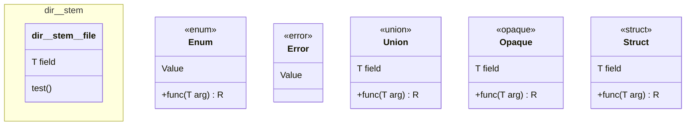

## :lizard: :mermaid: **meduza**

[![CI][ci-shield]][ci-url]
[![License][license-shield]][license-url]

### Zig codebase layout generator that emits a [Mermaid class diagram](https://mermaid.js.org/syntax/classDiagram.html).

#### :rocket: Usage

1. Add `meduza` as a dependency in your `build.zig.zon`.

    <details>

    <summary><code>build.zig.zon</code> example</summary>

    ```zig
    .{
        .name = "<name_of_your_package>",
        .version = "<version_of_your_package>",
        .dependencies = .{
            .meduza = .{
                .url = "https://github.com/tensorush/meduza/archive/<git_tag_or_commit_hash>.tar.gz",
                .hash = "<package_hash>",
            },
        },
    }
    ```

    Set `<package_hash>` to `12200000000000000000000000000000000000000000000000000000000000000000`, and Zig will provide the correct found value in an error message.

    </details>

2. Add `meduza` as a module in your `build.zig`.

    <details>

    <summary><code>build.zig</code> example</summary>

    ```zig
    const meduza = b.dependency("meduza", .{});
    exe.addModule("meduza", meduza.module("meduza"));
    ```

    </details>

#### :world_map: Legend



| Type          |                  Zig                   |                      Meduza                      |
|---------------|:--------------------------------------:|:------------------------------------------------:|
| File          |             `dir/stem.zig`             | `namespace dir__stem {class dir__stem__file {}}` |
| Enum          |    `const Enum = enum { Value, };`     |          `class Enum {<<enum>> Value }`          |
| Error         |   `const Error = error { Value, };`    |        `class Error { <<error>> Value }`         |
| Union         |  `const Union = union { field: T, };`  |       `class Union { <<union>> T field }`        |
| Opaque        | `const Opaque = opaque { field: T, };` |      `class Opaque { <<opaque>> T field }`       |
| Struct        | `const Struct = struct { field: T, };` |      `class Struct { <<struct>> T field }`       |
| Function      |  `pub fn` / `fn` `func(arg: T) R {}`   |           `+` / `-` `func(T arg) : R`            |
| Test function |            `test "name" {}`            |                 `test "name"()`                  |


<!-- MARKDOWN LINKS -->

[ci-shield]: https://img.shields.io/github/actions/workflow/status/tensorush/meduza/ci.yaml?branch=main&style=for-the-badge&logo=github&label=CI&labelColor=black
[ci-url]: https://github.com/tensorush/meduza/blob/main/.github/workflows/ci.yaml
[cd-shield]: https://img.shields.io/github/actions/workflow/status/tensorush/meduza/cd.yaml?branch=main&style=for-the-badge&logo=github&label=CD&labelColor=black
[cd-url]: https://github.com/tensorush/meduza/blob/main/.github/workflows/cd.yaml
[docs-shield]: https://img.shields.io/badge/click-F6A516?style=for-the-badge&logo=zig&logoColor=F6A516&label=docs&labelColor=black
[docs-url]: https://tensorush.github.io/meduza
[license-shield]: https://img.shields.io/github/license/tensorush/meduza.svg?style=for-the-badge&labelColor=black
[license-url]: https://github.com/tensorush/meduza/blob/main/LICENSE.md
