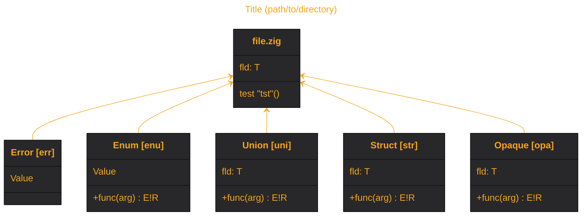

# meduza

[![CI][ci-shd]][ci-url]
[![CD][cd-shd]][cd-url]
[![MZ][mz-shd]][mz-url]
[![LC][lc-shd]][lc-url]

## Zig codebase graph generator.

### :rocket: Usage

```sh
git clone https://github.com/tensorush/meduza.git
cd meduza/
zig build exe -- -h
```

### :sparkles: Features

- Generate either `.html`, `.md`, or `.mmd` Mermaid class diagram.

- Generate one diagram for each of your codebase's source directories.

- Learn how to improve code readability from logged tips (enable with `-i`).

- Convert `.md` or `.mmd` diagram to `.svg` with Mermaid CLI ([see CD pipeline](https://github.com/tensorush/meduza/blob/main/.github/workflows/cd.yaml#L39)).

- Generate a large diagram (`maxTextSize` < 250'000) with Mermaid CLI ([see CD pipeline](https://github.com/tensorush/meduza/blob/main/.github/workflows/cd.yaml#L38)).

- Click on types to go to respective code lines on the remote (GitHub Mermaid forbids this, though).

### :world_map: Legend



| Type          |                  Zig                  |                  Meduza                   |
|---------------|:-------------------------------------:|:-----------------------------------------:|
| File          |              `file.zig`               |            `class file.zig {}`            |
| Error         |   `const Error = error { Value, };`   |  `class Error["Error [err]"] { Value }`   |
| Enum          |    `const Enum = enum { Value, };`    |   `class Enum["Enum [enu]"] { Value }`    |
| Union         |  `const Union = union { fld: T, };`   |  `class Union["Union [uni]"] { fld: T }`  |
| Struct        | `const Struct = struct { fld: T, };`  | `class Struct["Struct [str]"] { fld: T }` |
| Opaque        | `const Opaque = opaque { fld: T, };`  | `class Opaque["Opaque [opa]"] { fld: T }` |
| Function      |  `pub fn` / `fn` `func(arg) E!R {}`   |        `+` / `-` `func(arg) : E!R`        |
| Error union   |   `error{Value}!struct { fld: T }`    |     `error[Value]!struct [ fld: T ]`      |
| Test function |            `test "tst" {}`            |              `test "tst"()`               |
| Type relation | `B.zig`: `const A = enum { Value, };` |               `B.zig <-- A`               |

<!-- MARKDOWN LINKS -->

[ci-shd]: https://img.shields.io/github/actions/workflow/status/tensorush/meduza/ci.yaml?branch=main&style=for-the-badge&logo=github&label=CI&labelColor=black
[ci-url]: https://github.com/tensorush/meduza/blob/main/.github/workflows/ci.yaml
[cd-shd]: https://img.shields.io/github/actions/workflow/status/tensorush/meduza/cd.yaml?branch=main&style=for-the-badge&logo=github&label=CD&labelColor=black
[cd-url]: https://github.com/tensorush/meduza/blob/main/.github/workflows/cd.yaml
[mz-shd]: https://img.shields.io/badge/click-F6A516?style=for-the-badge&logo=zig&logoColor=F6A516&label=meduza&labelColor=black
[mz-url]: https://tensorush.github.io/meduza/src.svg
[lc-shd]: https://img.shields.io/github/license/tensorush/meduza.svg?style=for-the-badge&labelColor=black
[lc-url]: https://github.com/tensorush/meduza/blob/main/LICENSE.md
