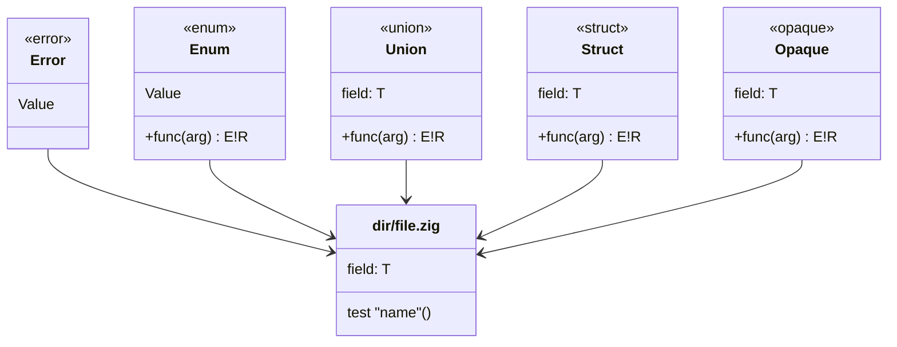

## :lizard: :mermaid: **meduza**

[![CI][ci-shield]][ci-url]
[![License][license-shield]][license-url]

### Zig codebase layout generator that emits a [Mermaid class diagram](https://mermaid.js.org/syntax/classDiagram.html).

#### :rocket: Usage

1. Add `meduza` as a dependency in your `build.zig.zon`.

    <details>

    <summary><code>build.zig.zon</code> example</summary>

    ```zig
    .{
        .name = "<name_of_your_package>",
        .version = "<version_of_your_package>",
        .dependencies = .{
            .meduza = .{
                .url = "https://github.com/tensorush/meduza/archive/<git_tag_or_commit_hash>.tar.gz",
                .hash = "<package_hash>",
            },
        },
    }
    ```

    Set `<package_hash>` to `12200000000000000000000000000000000000000000000000000000000000000000`, and Zig will provide the correct found value in an error message.

    </details>

2. Add `meduza` as a module in your `build.zig`.

    <details>

    <summary><code>build.zig</code> example</summary>

    ```zig
    const meduza = b.dependency("meduza", .{});
    exe.addModule("meduza", meduza.module("meduza"));
    ```

    </details>

#### :world_map: Legend



| Type          |                  Zig                   |                 Meduza                 |
|---------------|:--------------------------------------:|:--------------------------------------:|
| File          |             `dir/file.zig`             |        `class dir/file.zig {}`         |
| Error         |   `const Error = error { Value, };`    |   `class Error { <<error>> Value }`    |
| Enum          |    `const Enum = enum { Value, };`     |    `class Enum { <<enum>> Value }`     |
| Union         |  `const Union = union { field: T, };`  |  `class Union { <<union>> field: T }`  |
| Struct        | `const Struct = struct { field: T, };` | `class Struct { <<struct>> field: T }` |
| Opaque        | `const Opaque = opaque { field: T, };` | `class Opaque { <<opaque>> field: T }` |
| Function      |   `pub fn` / `fn` `func(arg) E!R {}`   |      `+` / `-` `func(arg) : E!R`       |
| Error union   |   `error{Value}!struct { field: T }`   |   `error[Value]!struct [ field: T ]`   |
| Test function |            `test "name" {}`            |            `test "name"()`             |
| Type relation | `B.zig`: `const A = enum { Value, };`  |             `A --> B.zig`              |


<!-- MARKDOWN LINKS -->

[ci-shield]: https://img.shields.io/github/actions/workflow/status/tensorush/meduza/ci.yaml?branch=main&style=for-the-badge&logo=github&label=CI&labelColor=black
[ci-url]: https://github.com/tensorush/meduza/blob/main/.github/workflows/ci.yaml
[license-shield]: https://img.shields.io/github/license/tensorush/meduza.svg?style=for-the-badge&labelColor=black&kill_cache=1
[license-url]: https://github.com/tensorush/meduza/blob/main/LICENSE.md
