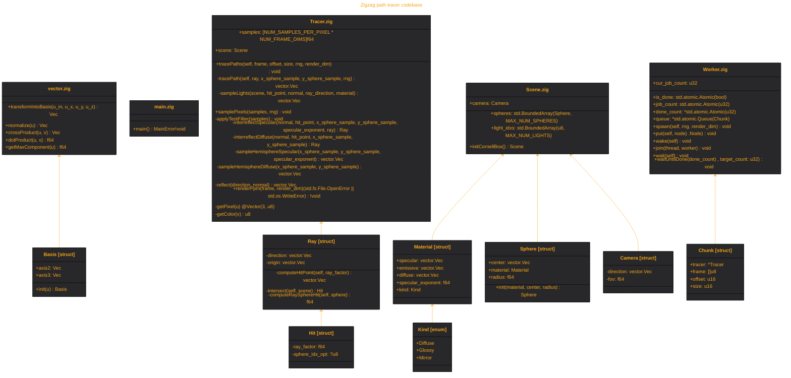

```mermaid
---
title: Zigzag path tracer codebase
---
%%{
    init: {
        'theme': 'base',
        'themeVariables': {
            'fontSize': '18px',
            'fontFamily': 'Arial',
            'lineColor': '#F6A516',
            'primaryColor': '#28282B',
            'primaryTextColor': '#F6A516'
        }
    }
}%%
classDiagram
class Basis["Basis [struct]"] {
    +axis2: Vec
    +axis3: Vec
    +init(u) Basis
}
link Basis "https://github.com/tensorush/zigzag/blob/main/src/vector.zig#L7"
class `vector.zig` {
    +transformIntoBasis(u_in, u_x, u_y, u_z) Vec
    +normalize(u) Vec
    +crossProduct(u, v) Vec
    +dotProduct(u, v) f64
    +getMaxComponent(u) f64
}
`vector.zig` <-- Basis
link `vector.zig` "https://github.com/tensorush/zigzag/blob/main/src/vector.zig"
class `main.zig` {
    +main() MainError!void
}
link `main.zig` "https://github.com/tensorush/zigzag/blob/main/src/main.zig"
class Hit["Hit [struct]"] {
    -ray_factor: f64
    -sphere_idx_opt: ?u8
}
link Hit "https://github.com/tensorush/zigzag/blob/main/src/Tracer.zig#L23"
class Ray["Ray [struct]"] {
    -direction: vector.Vec
    -origin: vector.Vec
    -computeHitPoint(self, ray_factor) vector.Vec
    -intersect(self, scene) Hit
    -computeRaySphereHit(self, sphere) f64
}
Ray <-- Hit
link Ray "https://github.com/tensorush/zigzag/blob/main/src/Tracer.zig#L19"
class `Tracer.zig` {
    +samples: [NUM_SAMPLES_PER_PIXEL * NUM_FRAME_DIMS]f64
    +scene: Scene
    +tracePaths(self, frame, offset, size, rng, render_dim) void
    -tracePath(self, ray, x_sphere_sample, y_sphere_sample, rng) vector.Vec
    -sampleLights(scene, hit_point, normal, ray_direction, material) vector.Vec
    +samplePixels(samples, rng) void
    -applyTentFilter(samples) void
    -interreflectSpecular(normal, hit_point, x_sphere_sample, y_sphere_sample, specular_exponent, ray) Ray
    -interreflectDiffuse(normal, hit_point, x_sphere_sample, y_sphere_sample) Ray
    -sampleHemisphereSpecular(x_sphere_sample, y_sphere_sample, specular_exponent) vector.Vec
    -sampleHemisphereDiffuse(x_sphere_sample, y_sphere_sample) vector.Vec
    -reflect(direction, normal) vector.Vec
    +renderPpm(frame, render_dim) (std.fs.File.OpenError || std.os.WriteError)!void
    -getPixel(u) @Vector(3, u8)
    -getColor(x) u8
}
`Tracer.zig` <-- Ray
link `Tracer.zig` "https://github.com/tensorush/zigzag/blob/main/src/Tracer.zig"
class Kind["Kind [enum]"] {
    +Diffuse
    +Glossy
    +Mirror
}
link Kind "https://github.com/tensorush/zigzag/blob/main/src/Scene.zig#L20"
class Material["Material [struct]"] {
    +specular: vector.Vec
    +emissive: vector.Vec
    +diffuse: vector.Vec
    +specular_exponent: f64
    +kind: Kind
}
Material <-- Kind
link Material "https://github.com/tensorush/zigzag/blob/main/src/Scene.zig#L13"
class Sphere["Sphere [struct]"] {
    +center: vector.Vec
    +material: Material
    +radius: f64
    +init(material, center, radius) Sphere
}
link Sphere "https://github.com/tensorush/zigzag/blob/main/src/Scene.zig#L27"
class Camera["Camera [struct]"] {
    -direction: vector.Vec
    -fov: f64
}
link Camera "https://github.com/tensorush/zigzag/blob/main/src/Scene.zig#L37"
class `Scene.zig` {
    +spheres: std.BoundedArray(Sphere, MAX_NUM_SPHERES)
    +light_idxs: std.BoundedArray(u8, MAX_NUM_LIGHTS)
    +camera: Camera
    +initCornellBox() Scene
}
`Scene.zig` <-- Material
`Scene.zig` <-- Sphere
`Scene.zig` <-- Camera
link `Scene.zig` "https://github.com/tensorush/zigzag/blob/main/src/Scene.zig"
class Chunk["Chunk [struct]"] {
    +tracer: *Tracer
    +frame: []u8
    +offset: u16
    +size: u16
}
link Chunk "https://github.com/tensorush/zigzag/blob/main/src/Worker.zig#L12"
class `Worker.zig` {
    +is_done: std.atomic.Atomic(bool)
    +job_count: std.atomic.Atomic(u32)
    +done_count: *std.atomic.Atomic(u32)
    +queue: *std.atomic.Queue(Chunk)
    +cur_job_count: u32
    +spawn(self, rng, render_dim) void
    +put(self, node) .Node) void
    +wake(self) void
    +join(thread, worker) void
    +wait(self) void
    +waitUntilDone(done_count) , target_count: u32) void
}
`Worker.zig` <-- Chunk
link `Worker.zig` "https://github.com/tensorush/zigzag/blob/main/src/Worker.zig"
```
