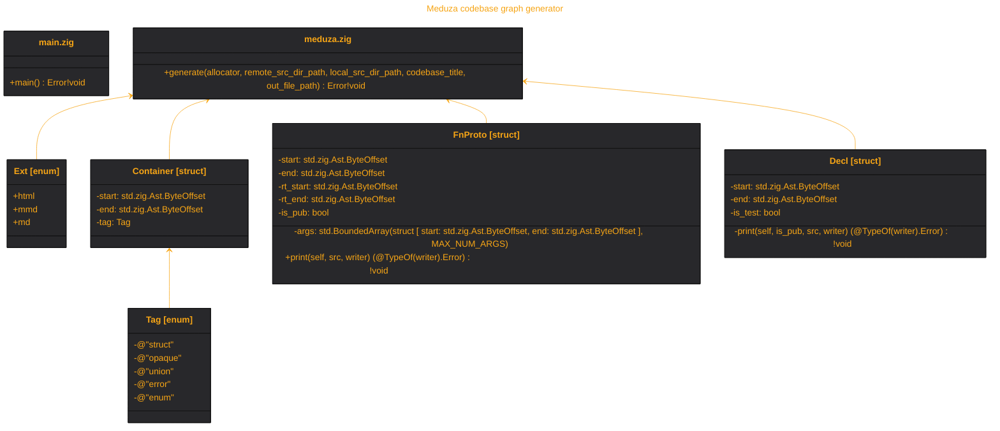

```mermaid
---
title: Meduza codebase graph generator
---
%%{
    init: {
        'theme': 'base',
        'themeVariables': {
            'fontSize': '18px',
            'fontFamily': 'arial',
            'lineColor': '#F6A516',
            'primaryColor': '#28282B',
            'primaryTextColor': '#F6A516'
        }
    }
}%%
classDiagram
class `main.zig` {
    +main() Error!void
}
link `main.zig` "https://github.com/tensorush/meduza/blob/main/src/main.zig"
class Ext["Ext [enum]"] {
    +html
    +mmd
    +md
}
link Ext "https://github.com/tensorush/meduza/blob/main/src/meduza.zig#L14"
class Tag["Tag [enum]"] {
    -@"struct"
    -@"opaque"
    -@"union"
    -@"error"
    -@"enum"
}
link Tag "https://github.com/tensorush/meduza/blob/main/src/meduza.zig#L25"
class Container["Container [struct]"] {
    -start: std.zig.Ast.ByteOffset
    -end: std.zig.Ast.ByteOffset
    -tag: Tag
}
Container <-- Tag
link Container "https://github.com/tensorush/meduza/blob/main/src/meduza.zig#L20"
class FnProto["FnProto [struct]"] {
    -start: std.zig.Ast.ByteOffset
    -end: std.zig.Ast.ByteOffset
    -args: std.BoundedArray(struct [ start: std.zig.Ast.ByteOffset, end: std.zig.Ast.ByteOffset ], MAX_NUM_ARGS)
    -rt_start: std.zig.Ast.ByteOffset
    -rt_end: std.zig.Ast.ByteOffset
    -is_pub: bool
    +print(self, src, writer) (@TypeOf(writer).Error)!void
}
link FnProto "https://github.com/tensorush/meduza/blob/main/src/meduza.zig#L34"
class Decl["Decl [struct]"] {
    -start: std.zig.Ast.ByteOffset
    -end: std.zig.Ast.ByteOffset
    -is_test: bool
    -print(self, is_pub, src, writer) (@TypeOf(writer).Error)!void
}
link Decl "https://github.com/tensorush/meduza/blob/main/src/meduza.zig#L61"
class `meduza.zig` {
    +generate(allocator, remote_src_dir_path, local_src_dir_path, codebase_title, out_file_path) Error!void
}
`meduza.zig` <-- Ext
`meduza.zig` <-- Container
`meduza.zig` <-- FnProto
`meduza.zig` <-- Decl
link `meduza.zig` "https://github.com/tensorush/meduza/blob/main/src/meduza.zig"
```
