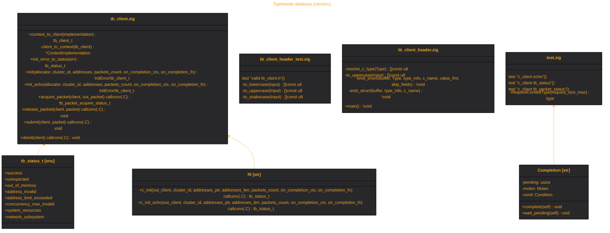

```mermaid
---
title: Tigerbeetle database (clients/c)
---
%%{
    init: {
        'theme': 'base',
        'themeVariables': {
            'fontSize': '18px',
            'fontFamily': 'arial',
            'lineColor': '#F6A516',
            'primaryColor': '#28282B',
            'primaryTextColor': '#F6A516'
        }
    }
}%%
classDiagram
class tb_status_t["tb_status_t [enu]"] {
    +success
    +unexpected
    +out_of_memory
    +address_invalid
    +address_limit_exceeded
    +concurrency_max_invalid
    +system_resources
    +network_subsystem
}
link tb_status_t "https://github.com/tigerbeetle/tigerbeetle/blob/main/src/clients/c/tb_client.zig#L9"
class ffi["ffi [str]"] {
    +c_init(out_client, cluster_id, addresses_ptr, addresses_len, packets_count, on_completion_ctx, on_completion_fn) callconv(.C) tb_status_t
    +c_init_echo(out_client, cluster_id, addresses_ptr, addresses_len, packets_count, on_completion_ctx, on_completion_fn) callconv(.C) tb_status_t
}
link ffi "https://github.com/tigerbeetle/tigerbeetle/blob/main/src/clients/c/tb_client.zig#L68"
class `tb_client.zig` {
    +context_to_client(implementation) tb_client_t
    -client_to_context(tb_client) *ContextImplementation
    +init_error_to_status(err) tb_status_t
    +init(allocator, cluster_id, addresses, packets_count, on_completion_ctx, on_completion_fn) InitError!tb_client_t
    +init_echo(allocator, cluster_id, addresses, packets_count, on_completion_ctx, on_completion_fn) InitError!tb_client_t
    +acquire_packet(client, out_packet) callconv(.C) tb_packet_acquire_status_t
    +release_packet(client, packet) callconv(.C) void
    +submit(client, packet) callconv(.C) void
    +deinit(client) callconv(.C) void
}
`tb_client.zig` <-- tb_status_t
`tb_client.zig` <-- ffi
link `tb_client.zig` "https://github.com/tigerbeetle/tigerbeetle/blob/main/src/clients/c/tb_client.zig"
class `tb_client_header_test.zig` {
    test "valid tb_client.h"()
    -to_lowercase(input) []const u8
    -to_uppercase(input) []const u8
    -to_snakecase(input) []const u8
}
link `tb_client_header_test.zig` "https://github.com/tigerbeetle/tigerbeetle/blob/main/src/clients/c/tb_client_header_test.zig"
class `tb_client_header.zig` {
    -resolve_c_type(Type) []const u8
    -to_uppercase(input) []const u8
    -emit_enum(buffer, Type, type_info, c_name, value_fmt, skip_fields) !void
    -emit_struct(buffer, type_info, c_name) !void
    +main() !void
}
link `tb_client_header.zig` "https://github.com/tigerbeetle/tigerbeetle/blob/main/src/clients/c/tb_client_header.zig"
class Completion["Completion [str]"] {
    -pending: usize
    -mutex: Mutex
    -cond: Condition
    +complete(self) void
    +wait_pending(self) void
}
link Completion "https://github.com/tigerbeetle/tigerbeetle/blob/main/src/clients/c/test.zig#L63"
class `test.zig` {
    test "c_client echo"()
    test "c_client tb_status"()
    test "c_client tb_packet_status"()
    -RequestContextType(request_size_max) type
}
`test.zig` <-- Completion
link `test.zig` "https://github.com/tigerbeetle/tigerbeetle/blob/main/src/clients/c/test.zig"
```
