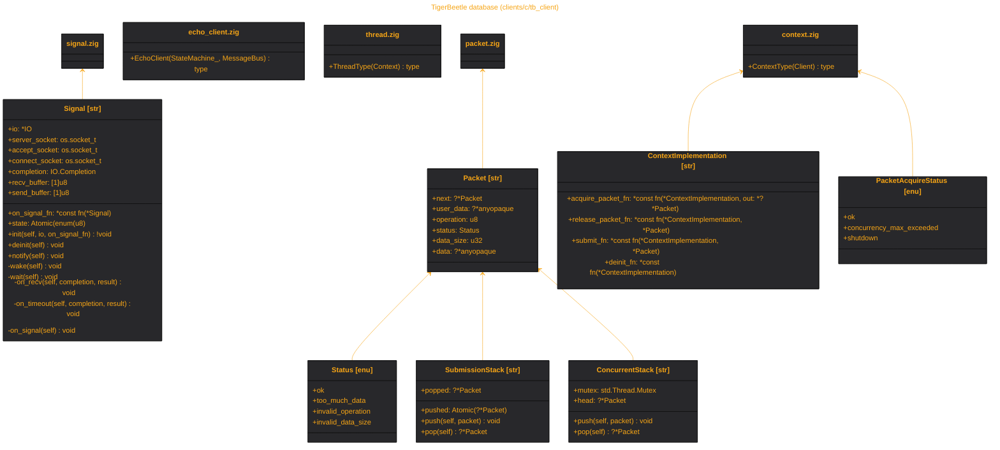

```mermaid
---
title: TigerBeetle database (clients/c/tb_client)
---
%%{
    init: {
        'theme': 'base',
        'themeVariables': {
            'fontSize': '18px',
            'fontFamily': 'arial',
            'lineColor': '#F6A516',
            'primaryColor': '#28282B',
            'primaryTextColor': '#F6A516'
        }
    }
}%%
classDiagram
class Signal["Signal [str]"] {
    +io: *IO
    +server_socket: os.socket_t
    +accept_socket: os.socket_t
    +connect_socket: os.socket_t
    +completion: IO.Completion
    +recv_buffer: [1]u8
    +send_buffer: [1]u8
    +on_signal_fn: *const fn (*Signal)
    +state: Atomic(enum(u8)
    +init(self, io, on_signal_fn) !void
    +deinit(self) void
    +notify(self) void
    -wake(self) void
    -wait(self) void
    -on_recv(self, completion, result) void
    -on_timeout(self, completion, result) void
    -on_signal(self) void
}
link Signal "https://github.com/tigerbeetle/tigerbeetle/blob/main/src/clients/c/tb_client/signal.zig#L15"
class `signal.zig`
`signal.zig` <-- Signal
link `signal.zig` "https://github.com/tigerbeetle/tigerbeetle/blob/main/src/clients/c/tb_client/signal.zig"
class `echo_client.zig` {
    +EchoClient(StateMachine_, MessageBus) type
}
link `echo_client.zig` "https://github.com/tigerbeetle/tigerbeetle/blob/main/src/clients/c/tb_client/echo_client.zig"
class `thread.zig` {
    +ThreadType(Context) type
}
link `thread.zig` "https://github.com/tigerbeetle/tigerbeetle/blob/main/src/clients/c/tb_client/thread.zig"
class Status["Status [enu]"] {
    +ok
    +too_much_data
    +invalid_operation
    +invalid_data_size
}
link Status "https://github.com/tigerbeetle/tigerbeetle/blob/main/src/clients/c/tb_client/packet.zig#L13"
class SubmissionStack["SubmissionStack [str]"] {
    +pushed: Atomic(?*Packet)
    +popped: ?*Packet
    +push(self, packet) void
    +pop(self) ?*Packet
}
link SubmissionStack "https://github.com/tigerbeetle/tigerbeetle/blob/main/src/clients/c/tb_client/packet.zig#L22"
class ConcurrentStack["ConcurrentStack [str]"] {
    +mutex: std.Thread.Mutex
    +head: ?*Packet
    +push(self, packet) void
    +pop(self) ?*Packet
}
link ConcurrentStack "https://github.com/tigerbeetle/tigerbeetle/blob/main/src/clients/c/tb_client/packet.zig#L49"
class Packet["Packet [str]"] {
    +next: ?*Packet
    +user_data: ?*anyopaque
    +operation: u8
    +status: Status
    +data_size: u32
    +data: ?*anyopaque
}
Packet <-- Status
Packet <-- SubmissionStack
Packet <-- ConcurrentStack
link Packet "https://github.com/tigerbeetle/tigerbeetle/blob/main/src/clients/c/tb_client/packet.zig#L5"
class `packet.zig`
`packet.zig` <-- Packet
link `packet.zig` "https://github.com/tigerbeetle/tigerbeetle/blob/main/src/clients/c/tb_client/packet.zig"
class ContextImplementation["ContextImplementation [str]"] {
    +acquire_packet_fn: *const fn (*ContextImplementation, out: *?*Packet)
    +release_packet_fn: *const fn (*ContextImplementation, *Packet)
    +submit_fn: *const fn (*ContextImplementation, *Packet)
    +deinit_fn: *const fn (*ContextImplementation)
}
link ContextImplementation "https://github.com/tigerbeetle/tigerbeetle/blob/main/src/clients/c/tb_client/context.zig#L29"
class PacketAcquireStatus["PacketAcquireStatus [enu]"] {
    +ok
    +concurrency_max_exceeded
    +shutdown
}
link PacketAcquireStatus "https://github.com/tigerbeetle/tigerbeetle/blob/main/src/clients/c/tb_client/context.zig#L45"
class `context.zig` {
    +ContextType(Client) type
}
`context.zig` <-- ContextImplementation
`context.zig` <-- PacketAcquireStatus
link `context.zig` "https://github.com/tigerbeetle/tigerbeetle/blob/main/src/clients/c/tb_client/context.zig"
```
