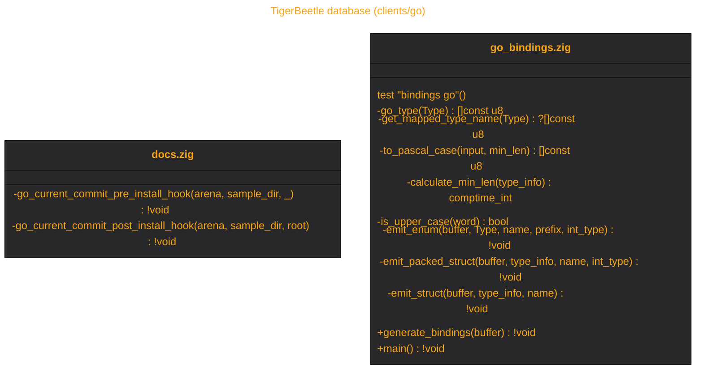

```mermaid
---
title: TigerBeetle database (clients/go)
---
%%{
    init: {
        'theme': 'base',
        'themeVariables': {
            'fontSize': '18px',
            'fontFamily': 'arial',
            'lineColor': '#F6A516',
            'primaryColor': '#28282B',
            'primaryTextColor': '#F6A516'
        }
    }
}%%
classDiagram
class `docs.zig` {
    -go_current_commit_pre_install_hook(arena, sample_dir, _) !void
    -go_current_commit_post_install_hook(arena, sample_dir, root) !void
}
link `docs.zig` "https://github.com/tigerbeetle/tigerbeetle/blob/main/src/clients/go/docs.zig"
class `go_bindings.zig` {
    test "bindings go"()
    -go_type(Type) []const u8
    -get_mapped_type_name(Type) ?[]const u8
    -to_pascal_case(input, min_len) []const u8
    -calculate_min_len(type_info) comptime_int
    -is_upper_case(word) bool
    -emit_enum(buffer, Type, name, prefix, int_type) !void
    -emit_packed_struct(buffer, type_info, name, int_type) !void
    -emit_struct(buffer, type_info, name) !void
    +generate_bindings(buffer) !void
    +main() !void
}
link `go_bindings.zig` "https://github.com/tigerbeetle/tigerbeetle/blob/main/src/clients/go/go_bindings.zig"
```
