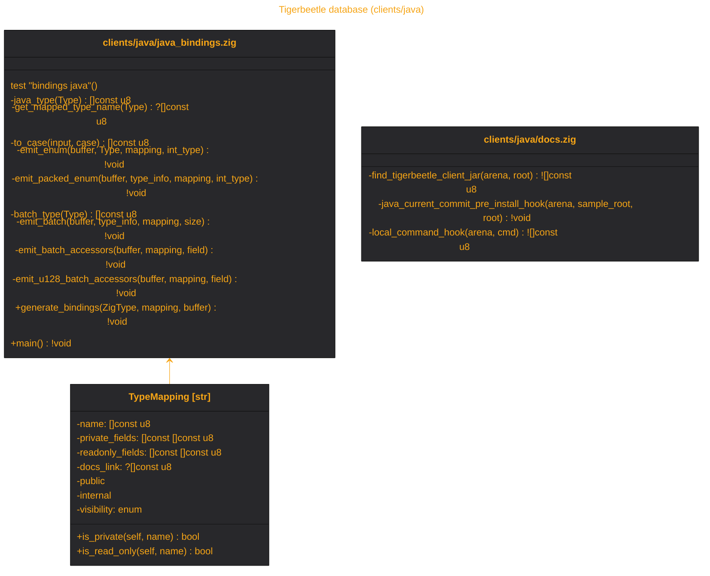

```mermaid
---
title: Tigerbeetle database (clients/java)
---
%%{
    init: {
        'theme': 'base',
        'themeVariables': {
            'fontSize': '18px',
            'fontFamily': 'arial',
            'lineColor': '#F6A516',
            'primaryColor': '#28282B',
            'primaryTextColor': '#F6A516'
        }
    }
}%%
classDiagram
class TypeMapping["TypeMapping [str]"] {
    -name: []const u8
    -private_fields: []const []const u8
    -readonly_fields: []const []const u8
    -docs_link: ?[]const u8
    -public
    -internal
    -visibility: enum
    +is_private(self, name) bool
    +is_read_only(self, name) bool
}
link TypeMapping "https://github.com/tigerbeetle/tigerbeetle/blob/main/src/clients/java/java_bindings.zig#L10"
class `clients/java/java_bindings.zig` {
    test "bindings java"()
    -java_type(Type) []const u8
    -get_mapped_type_name(Type) ?[]const u8
    -to_case(input, case) []const u8
    -emit_enum(buffer, Type, mapping, int_type) !void
    -emit_packed_enum(buffer, type_info, mapping, int_type) !void
    -batch_type(Type) []const u8
    -emit_batch(buffer, type_info, mapping, size) !void
    -emit_batch_accessors(buffer, mapping, field) !void
    -emit_u128_batch_accessors(buffer, mapping, field) !void
    +generate_bindings(ZigType, mapping, buffer) !void
    +main() !void
}
`clients/java/java_bindings.zig` <-- TypeMapping
link `clients/java/java_bindings.zig` "https://github.com/tigerbeetle/tigerbeetle/blob/main/src/clients/java/java_bindings.zig"
class `clients/java/docs.zig` {
    -find_tigerbeetle_client_jar(arena, root) ![]const u8
    -java_current_commit_pre_install_hook(arena, sample_root, root) !void
    -local_command_hook(arena, cmd) ![]const u8
}
link `clients/java/docs.zig` "https://github.com/tigerbeetle/tigerbeetle/blob/main/src/clients/java/docs.zig"
```
