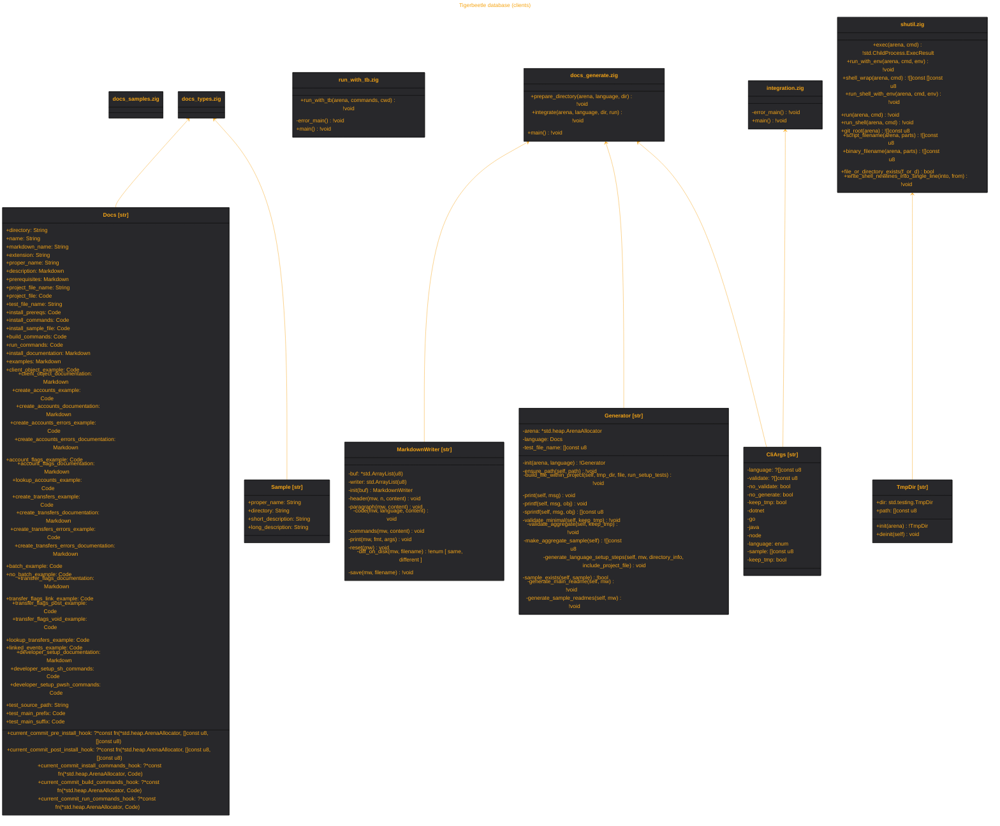

```mermaid
---
title: Tigerbeetle database (clients)
---
%%{
    init: {
        'theme': 'base',
        'themeVariables': {
            'fontSize': '18px',
            'fontFamily': 'arial',
            'lineColor': '#F6A516',
            'primaryColor': '#28282B',
            'primaryTextColor': '#F6A516'
        }
    }
}%%
classDiagram
class `docs_samples.zig`
link `docs_samples.zig` "https://github.com/tigerbeetle/tigerbeetle/blob/main/src/clients/docs_samples.zig"
class Docs["Docs [str]"] {
    +directory: String
    +name: String
    +markdown_name: String
    +extension: String
    +proper_name: String
    +description: Markdown
    +prerequisites: Markdown
    +project_file_name: String
    +project_file: Code
    +test_file_name: String
    +install_prereqs: Code
    +current_commit_pre_install_hook: ?*const fn (*std.heap.ArenaAllocator, []const u8, []const u8)
    +current_commit_post_install_hook: ?*const fn (*std.heap.ArenaAllocator, []const u8, []const u8)
    +install_commands: Code
    +install_sample_file: Code
    +build_commands: Code
    +run_commands: Code
    +current_commit_install_commands_hook: ?*const fn (*std.heap.ArenaAllocator, Code)
    +current_commit_build_commands_hook: ?*const fn (*std.heap.ArenaAllocator, Code)
    +current_commit_run_commands_hook: ?*const fn (*std.heap.ArenaAllocator, Code)
    +install_documentation: Markdown
    +examples: Markdown
    +client_object_example: Code
    +client_object_documentation: Markdown
    +create_accounts_example: Code
    +create_accounts_documentation: Markdown
    +create_accounts_errors_example: Code
    +create_accounts_errors_documentation: Markdown
    +account_flags_example: Code
    +account_flags_documentation: Markdown
    +lookup_accounts_example: Code
    +create_transfers_example: Code
    +create_transfers_documentation: Markdown
    +create_transfers_errors_example: Code
    +create_transfers_errors_documentation: Markdown
    +batch_example: Code
    +no_batch_example: Code
    +transfer_flags_documentation: Markdown
    +transfer_flags_link_example: Code
    +transfer_flags_post_example: Code
    +transfer_flags_void_example: Code
    +lookup_transfers_example: Code
    +linked_events_example: Code
    +developer_setup_documentation: Markdown
    +developer_setup_sh_commands: Code
    +developer_setup_pwsh_commands: Code
    +test_source_path: String
    +test_main_prefix: Code
    +test_main_suffix: Code
}
link Docs "https://github.com/tigerbeetle/tigerbeetle/blob/main/src/clients/docs_types.zig#L13"
class Sample["Sample [str]"] {
    +proper_name: String
    +directory: String
    +short_description: String
    +long_description: String
}
link Sample "https://github.com/tigerbeetle/tigerbeetle/blob/main/src/clients/docs_types.zig#L129"
class `docs_types.zig`
`docs_types.zig` <-- Docs
`docs_types.zig` <-- Sample
link `docs_types.zig` "https://github.com/tigerbeetle/tigerbeetle/blob/main/src/clients/docs_types.zig"
class `run_with_tb.zig` {
    +run_with_tb(arena, commands, cwd) !void
    -error_main() !void
    +main() !void
}
link `run_with_tb.zig` "https://github.com/tigerbeetle/tigerbeetle/blob/main/src/clients/run_with_tb.zig"
class MarkdownWriter["MarkdownWriter [str]"] {
    -buf: *std.ArrayList(u8)
    -writer: std.ArrayList(u8)
    -init(buf) MarkdownWriter
    -header(mw, n, content) void
    -paragraph(mw, content) void
    -code(mw, language, content) void
    -commands(mw, content) void
    -print(mw, fmt, args) void
    -reset(mw) void
    -diff_on_disk(mw, filename) !enum [ same, different ]
    -save(mw, filename) !void
}
link MarkdownWriter "https://github.com/tigerbeetle/tigerbeetle/blob/main/src/clients/docs_generate.zig#L27"
class Generator["Generator [str]"] {
    -arena: *std.heap.ArenaAllocator
    -language: Docs
    -test_file_name: []const u8
    -init(arena, language) !Generator
    -ensure_path(self, path) !void
    -build_file_within_project(self, tmp_dir, file, run_setup_tests) !void
    -print(self, msg) void
    -printf(self, msg, obj) void
    -sprintf(self, msg, obj) []const u8
    -validate_minimal(self, keep_tmp) !void
    -validate_aggregate(self, keep_tmp) !void
    -make_aggregate_sample(self) ![]const u8
    -generate_language_setup_steps(self, mw, directory_info, include_project_file) void
    -sample_exists(self, sample) !bool
    -generate_main_readme(self, mw) !void
    -generate_sample_readmes(self, mw) !void
}
link Generator "https://github.com/tigerbeetle/tigerbeetle/blob/main/src/clients/docs_generate.zig#L203"
class CliArgs["CliArgs [str]"] {
    -language: ?[]const u8
    -validate: ?[]const u8
    -no_validate: bool
    -no_generate: bool
    -keep_tmp: bool
}
link CliArgs "https://github.com/tigerbeetle/tigerbeetle/blob/main/src/clients/docs_generate.zig#L807"
class `docs_generate.zig` {
    +prepare_directory(arena, language, dir) !void
    +integrate(arena, language, dir, run) !void
    +main() !void
}
`docs_generate.zig` <-- MarkdownWriter
`docs_generate.zig` <-- Generator
`docs_generate.zig` <-- CliArgs
link `docs_generate.zig` "https://github.com/tigerbeetle/tigerbeetle/blob/main/src/clients/docs_generate.zig"
class TmpDir["TmpDir [str]"] {
    +dir: std.testing.TmpDir
    +path: []const u8
    +init(arena) !TmpDir
    +deinit(self) void
}
link TmpDir "https://github.com/tigerbeetle/tigerbeetle/blob/main/src/clients/shutil.zig#L131"
class `shutil.zig` {
    +exec(arena, cmd) !std.ChildProcess.ExecResult
    +run_with_env(arena, cmd, env) !void
    +shell_wrap(arena, cmd) ![]const []const u8
    +run_shell_with_env(arena, cmd, env) !void
    +run(arena, cmd) !void
    +run_shell(arena, cmd) !void
    +git_root(arena) ![]const u8
    +script_filename(arena, parts) ![]const u8
    +binary_filename(arena, parts) ![]const u8
    +file_or_directory_exists(f_or_d) bool
    +write_shell_newlines_into_single_line(into, from) !void
}
`shutil.zig` <-- TmpDir
link `shutil.zig` "https://github.com/tigerbeetle/tigerbeetle/blob/main/src/clients/shutil.zig"
class CliArgs["CliArgs [str]"] {
    -dotnet
    -go
    -java
    -node
    -language: enum
    -sample: []const u8
    -keep_tmp: bool
}
link CliArgs "https://github.com/tigerbeetle/tigerbeetle/blob/main/src/clients/integration.zig#L24"
class `integration.zig` {
    -error_main() !void
    +main() !void
}
`integration.zig` <-- CliArgs
link `integration.zig` "https://github.com/tigerbeetle/tigerbeetle/blob/main/src/clients/integration.zig"
```
