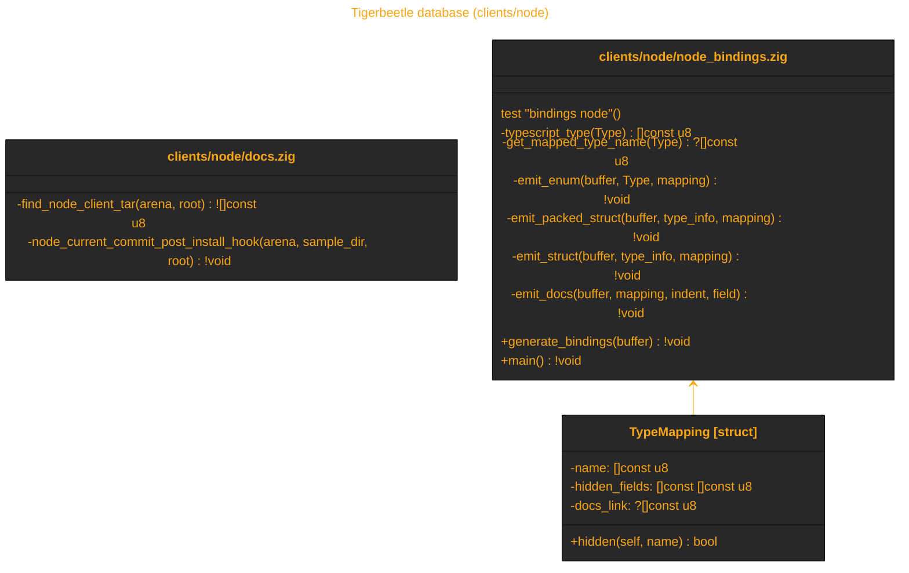

```mermaid
---
title: Tigerbeetle database (clients/node)
---
%%{
    init: {
        'theme': 'base',
        'themeVariables': {
            'fontSize': '18px',
            'fontFamily': 'arial',
            'lineColor': '#F6A516',
            'primaryColor': '#28282B',
            'primaryTextColor': '#F6A516'
        }
    }
}%%
classDiagram
class `clients/node/docs.zig` {
    -find_node_client_tar(arena, root) ![]const u8
    -node_current_commit_post_install_hook(arena, sample_dir, root) !void
}
link `clients/node/docs.zig` "https://github.com/tigerbeetle/tigerbeetle/blob/main/src/clients/node/docs.zig"
class TypeMapping["TypeMapping [struct]"] {
    -name: []const u8
    -hidden_fields: []const []const u8
    -docs_link: ?[]const u8
    +hidden(self, name) bool
}
link TypeMapping "https://github.com/tigerbeetle/tigerbeetle/blob/main/src/clients/node/node_bindings.zig#L7"
class `clients/node/node_bindings.zig` {
    test "bindings node"()
    -typescript_type(Type) []const u8
    -get_mapped_type_name(Type) ?[]const u8
    -emit_enum(buffer, Type, mapping) !void
    -emit_packed_struct(buffer, type_info, mapping) !void
    -emit_struct(buffer, type_info, mapping) !void
    -emit_docs(buffer, mapping, indent, field) !void
    +generate_bindings(buffer) !void
    +main() !void
}
`clients/node/node_bindings.zig` <-- TypeMapping
link `clients/node/node_bindings.zig` "https://github.com/tigerbeetle/tigerbeetle/blob/main/src/clients/node/node_bindings.zig"
```
