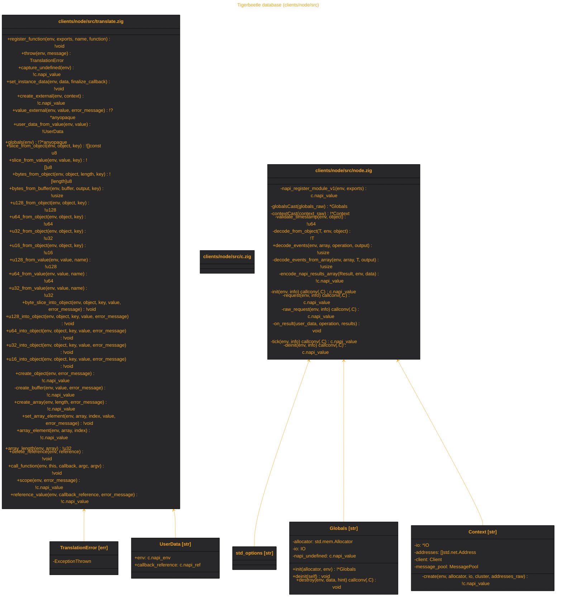

```mermaid
---
title: Tigerbeetle database (clients/node/src)
---
%%{
    init: {
        'theme': 'base',
        'themeVariables': {
            'fontSize': '18px',
            'fontFamily': 'arial',
            'lineColor': '#F6A516',
            'primaryColor': '#28282B',
            'primaryTextColor': '#F6A516'
        }
    }
}%%
classDiagram
class TranslationError["TranslationError [err]"] {
    -ExceptionThrown
}
link TranslationError "https://github.com/tigerbeetle/tigerbeetle/blob/main/src/clients/node/src/translate.zig#L21"
class UserData["UserData [str]"] {
    +env: c.napi_env
    +callback_reference: c.napi_ref
}
link UserData "https://github.com/tigerbeetle/tigerbeetle/blob/main/src/clients/node/src/translate.zig#L73"
class `clients/node/src/translate.zig` {
    +register_function(env, exports, name, function) !void
    +throw(env, message) TranslationError
    +capture_undefined(env) !c.napi_value
    +set_instance_data(env, data, finalize_callback) !void
    +create_external(env, context) !c.napi_value
    +value_external(env, value, error_message) !?*anyopaque
    +user_data_from_value(env, value) !UserData
    +globals(env) !?*anyopaque
    +slice_from_object(env, object, key) ![]const u8
    +slice_from_value(env, value, key) ![]u8
    +bytes_from_object(env, object, length, key) ![length]u8
    +bytes_from_buffer(env, buffer, output, key) !usize
    +u128_from_object(env, object, key) !u128
    +u64_from_object(env, object, key) !u64
    +u32_from_object(env, object, key) !u32
    +u16_from_object(env, object, key) !u16
    +u128_from_value(env, value, name) !u128
    +u64_from_value(env, value, name) !u64
    +u32_from_value(env, value, name) !u32
    +byte_slice_into_object(env, object, key, value, error_message) !void
    +u128_into_object(env, object, key, value, error_message) !void
    +u64_into_object(env, object, key, value, error_message) !void
    +u32_into_object(env, object, key, value, error_message) !void
    +u16_into_object(env, object, key, value, error_message) !void
    +create_object(env, error_message) !c.napi_value
    -create_buffer(env, value, error_message) !c.napi_value
    +create_array(env, length, error_message) !c.napi_value
    +set_array_element(env, array, index, value, error_message) !void
    +array_element(env, array, index) !c.napi_value
    +array_length(env, array) !u32
    +delete_reference(env, reference) !void
    +call_function(env, this, callback, argc, argv) !void
    +scope(env, error_message) !c.napi_value
    +reference_value(env, callback_reference, error_message) !c.napi_value
}
`clients/node/src/translate.zig` <-- TranslationError
`clients/node/src/translate.zig` <-- UserData
link `clients/node/src/translate.zig` "https://github.com/tigerbeetle/tigerbeetle/blob/main/src/clients/node/src/translate.zig"
class `clients/node/src/c.zig`
link `clients/node/src/c.zig` "https://github.com/tigerbeetle/tigerbeetle/blob/main/src/clients/node/src/c.zig"
class std_options["std_options [str]"]
link std_options "https://github.com/tigerbeetle/tigerbeetle/blob/main/src/clients/node/src/node.zig#L27"
class Globals["Globals [str]"] {
    -allocator: std.mem.Allocator
    -io: IO
    -napi_undefined: c.napi_value
    +init(allocator, env) !*Globals
    +deinit(self) void
    +destroy(env, data, hint) callconv(.C) void
}
link Globals "https://github.com/tigerbeetle/tigerbeetle/blob/main/src/clients/node/src/node.zig#L72"
class Context["Context [str]"] {
    -io: *IO
    -addresses: []std.net.Address
    -client: Client
    -message_pool: MessagePool
    -create(env, allocator, io, cluster, addresses_raw) !c.napi_value
}
link Context "https://github.com/tigerbeetle/tigerbeetle/blob/main/src/clients/node/src/node.zig#L123"
class `clients/node/src/node.zig` {
    -napi_register_module_v1(env, exports) c.napi_value
    -globalsCast(globals_raw) *Globals
    -contextCast(context_raw) !*Context
    -validate_timestamp(env, object) !u64
    -decode_from_object(T, env, object) !T
    +decode_events(env, array, operation, output) !usize
    -decode_events_from_array(env, array, T, output) !usize
    -encode_napi_results_array(Result, env, data) !c.napi_value
    -init(env, info) callconv(.C) c.napi_value
    -request(env, info) callconv(.C) c.napi_value
    -raw_request(env, info) callconv(.C) c.napi_value
    -on_result(user_data, operation, results) void
    -tick(env, info) callconv(.C) c.napi_value
    -deinit(env, info) callconv(.C) c.napi_value
}
`clients/node/src/node.zig` <-- std_options
`clients/node/src/node.zig` <-- Globals
`clients/node/src/node.zig` <-- Context
link `clients/node/src/node.zig` "https://github.com/tigerbeetle/tigerbeetle/blob/main/src/clients/node/src/node.zig"
```
