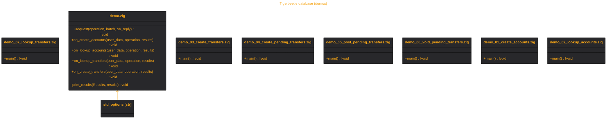

```mermaid
---
title: Tigerbeetle database (demos)
---
%%{
    init: {
        'theme': 'base',
        'themeVariables': {
            'fontSize': '18px',
            'fontFamily': 'arial',
            'lineColor': '#F6A516',
            'primaryColor': '#28282B',
            'primaryTextColor': '#F6A516'
        }
    }
}%%
classDiagram
class `demo_07_lookup_transfers.zig` {
    +main() !void
}
link `demo_07_lookup_transfers.zig` "https://github.com/tigerbeetle/tigerbeetle/blob/main/src/demos/demo_07_lookup_transfers.zig"
class std_options["std_options [str]"]
link std_options "https://github.com/tigerbeetle/tigerbeetle/blob/main/src/demos/demo.zig#L23"
class `demo.zig` {
    +request(operation, batch, on_reply) !void
    +on_create_accounts(user_data, operation, results) void
    +on_lookup_accounts(user_data, operation, results) void
    +on_lookup_transfers(user_data, operation, results) void
    +on_create_transfers(user_data, operation, results) void
    -print_results(Results, results) void
}
`demo.zig` <-- std_options
link `demo.zig` "https://github.com/tigerbeetle/tigerbeetle/blob/main/src/demos/demo.zig"
class `demo_03_create_transfers.zig` {
    +main() !void
}
link `demo_03_create_transfers.zig` "https://github.com/tigerbeetle/tigerbeetle/blob/main/src/demos/demo_03_create_transfers.zig"
class `demo_04_create_pending_transfers.zig` {
    +main() !void
}
link `demo_04_create_pending_transfers.zig` "https://github.com/tigerbeetle/tigerbeetle/blob/main/src/demos/demo_04_create_pending_transfers.zig"
class `demo_05_post_pending_transfers.zig` {
    +main() !void
}
link `demo_05_post_pending_transfers.zig` "https://github.com/tigerbeetle/tigerbeetle/blob/main/src/demos/demo_05_post_pending_transfers.zig"
class `demo_06_void_pending_transfers.zig` {
    +main() !void
}
link `demo_06_void_pending_transfers.zig` "https://github.com/tigerbeetle/tigerbeetle/blob/main/src/demos/demo_06_void_pending_transfers.zig"
class `demo_01_create_accounts.zig` {
    +main() !void
}
link `demo_01_create_accounts.zig` "https://github.com/tigerbeetle/tigerbeetle/blob/main/src/demos/demo_01_create_accounts.zig"
class `demo_02_lookup_accounts.zig` {
    +main() !void
}
link `demo_02_lookup_accounts.zig` "https://github.com/tigerbeetle/tigerbeetle/blob/main/src/demos/demo_02_lookup_accounts.zig"
```
