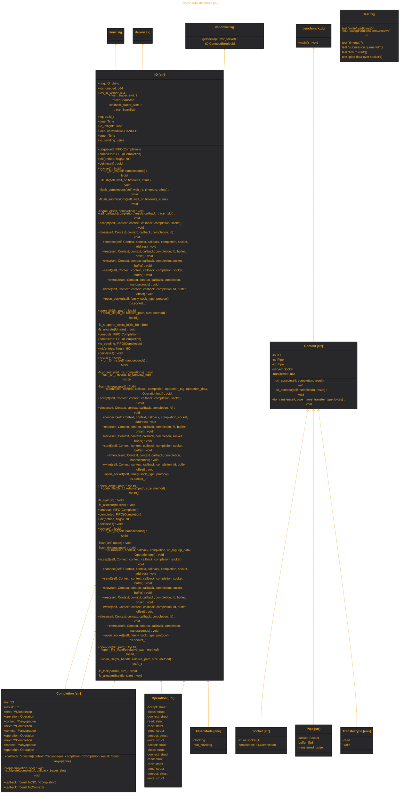

```mermaid
---
title: TigerBeetle database (io)
---
%%{
    init: {
        'theme': 'base',
        'themeVariables': {
            'fontSize': '18px',
            'fontFamily': 'arial',
            'lineColor': '#F6A516',
            'primaryColor': '#28282B',
            'primaryTextColor': '#F6A516'
        }
    }
}%%
classDiagram
class Completion["Completion [str]"] {
    +io: *IO
    +result: i32
    +next: ?*Completion
    +operation: Operation
    +context: ?*anyopaque
    +callback: *const fn (context: ?*anyopaque, completion: *Completion, result: *const anyopaque)
    -prep(completion, sqe) void
    -complete(completion, callback_tracer_slot) void
}
link Completion "https://github.com/tigerbeetle/tigerbeetle/blob/main/src/io/linux.zig#L244"
class Operation["Operation [uni]"] {
    -accept: struct
    -close: struct
    -connect: struct
    -read: struct
    -recv: struct
    -send: struct
    -timeout: struct
    -write: struct
}
link Operation "https://github.com/tigerbeetle/tigerbeetle/blob/main/src/io/linux.zig#L546"
class IO["IO [str]"] {
    +ring: IO_Uring
    +unqueued: FIFO(Completion)
    +completed: FIFO(Completion)
    +ios_queued: u64
    +ios_in_kernel: u64
    +flush_tracer_slot: ?tracer.SpanStart
    +callback_tracer_slot: ?tracer.SpanStart
    +init(entries, flags) !IO
    +deinit(self) void
    +tick(self) !void
    +run_for_ns(self, nanoseconds) !void
    -flush(self, wait_nr, timeouts, etime) !void
    -flush_completions(self, wait_nr, timeouts, etime) !void
    -flush_submissions(self, wait_nr, timeouts, etime) !void
    -enqueue(self, completion) void
    -call_callback(completion, result, callback_tracer_slot) void
    +accept(self, Context, context, callback, completion, socket) void
    +close(self, Context, context, callback, completion, fd) void
    +connect(self, Context, context, callback, completion, socket, address) void
    +read(self, Context, context, callback, completion, fd, buffer, offset) void
    +recv(self, Context, context, callback, completion, socket, buffer) void
    +send(self, Context, context, callback, completion, socket, buffer) void
    +timeout(self, Context, context, callback, completion, nanoseconds) void
    +write(self, Context, context, callback, completion, fd, buffer, offset) void
    +open_socket(self, family, sock_type, protocol) !os.socket_t
    +open_dir(dir_path) !os.fd_t
    +open_file(dir_fd, relative_path, size, method) !os.fd_t
    -fs_supports_direct_io(dir_fd) !bool
    -fs_allocate(fd, size) !void
}
IO <-- Completion
IO <-- Operation
link IO "https://github.com/tigerbeetle/tigerbeetle/blob/main/src/io/linux.zig#L16"
class `linux.zig`
`linux.zig` <-- IO
link `linux.zig` "https://github.com/tigerbeetle/tigerbeetle/blob/main/src/io/linux.zig"
class Completion["Completion [str]"] {
    +next: ?*Completion
    +context: ?*anyopaque
    +callback: *const fn (*IO, *Completion)
    +operation: Operation
}
link Completion "https://github.com/tigerbeetle/tigerbeetle/blob/main/src/io/darwin.zig#L190"
class Operation["Operation [uni]"] {
    -accept: struct
    -close: struct
    -connect: struct
    -read: struct
    -recv: struct
    -send: struct
    -timeout: struct
    -write: struct
}
link Operation "https://github.com/tigerbeetle/tigerbeetle/blob/main/src/io/darwin.zig#L197"
class IO["IO [str]"] {
    +kq: os.fd_t
    +time: Time
    +io_inflight: usize
    +timeouts: FIFO(Completion)
    +completed: FIFO(Completion)
    +io_pending: FIFO(Completion)
    +init(entries, flags) !IO
    +deinit(self) void
    +tick(self) !void
    +run_for_ns(self, nanoseconds) !void
    -flush(self, wait_for_completions) !void
    -flush_io(_, events, io_pending_top) usize
    -flush_timeouts(self) ?u64
    -submit(self, context, callback, completion, operation_tag, operation_data, OperationImpl) void
    +accept(self, Context, context, callback, completion, socket) void
    +close(self, Context, context, callback, completion, fd) void
    +connect(self, Context, context, callback, completion, socket, address) void
    +read(self, Context, context, callback, completion, fd, buffer, offset) void
    +recv(self, Context, context, callback, completion, socket, buffer) void
    +send(self, Context, context, callback, completion, socket, buffer) void
    +timeout(self, Context, context, callback, completion, nanoseconds) void
    +write(self, Context, context, callback, completion, fd, buffer, offset) void
    +open_socket(self, family, sock_type, protocol) !os.socket_t
    +open_dir(dir_path) !os.fd_t
    +open_file(dir_fd, relative_path, size, method) !os.fd_t
    -fs_sync(fd) !void
    -fs_allocate(fd, size) !void
}
IO <-- Completion
IO <-- Operation
link IO "https://github.com/tigerbeetle/tigerbeetle/blob/main/src/io/darwin.zig#L12"
class `darwin.zig`
`darwin.zig` <-- IO
link `darwin.zig` "https://github.com/tigerbeetle/tigerbeetle/blob/main/src/io/darwin.zig"
class FlushMode["FlushMode [enu]"] {
    -blocking
    -non_blocking
}
link FlushMode "https://github.com/tigerbeetle/tigerbeetle/blob/main/src/io/windows.zig#L59"
class Completion["Completion [str]"] {
    +next: ?*Completion
    +context: ?*anyopaque
    +callback: *const fn (Context)
    +operation: Operation
}
link Completion "https://github.com/tigerbeetle/tigerbeetle/blob/main/src/io/windows.zig#L160"
class IO["IO [str]"] {
    +iocp: os.windows.HANDLE
    +timer: Time
    +io_pending: usize
    +timeouts: FIFO(Completion)
    +completed: FIFO(Completion)
    +init(entries, flags) !IO
    +deinit(self) void
    +tick(self) !void
    +run_for_ns(self, nanoseconds) !void
    -flush(self, mode) !void
    -flush_timeouts(self) ?u64
    -submit(self, context, callback, completion, op_tag, op_data, OperationImpl) void
    +accept(self, Context, context, callback, completion, socket) void
    +connect(self, Context, context, callback, completion, socket, address) void
    +send(self, Context, context, callback, completion, socket, buffer) void
    +recv(self, Context, context, callback, completion, socket, buffer) void
    +read(self, Context, context, callback, completion, fd, buffer, offset) void
    +write(self, Context, context, callback, completion, fd, buffer, offset) void
    +close(self, Context, context, callback, completion, fd) void
    +timeout(self, Context, context, callback, completion, nanoseconds) void
    +open_socket(self, family, sock_type, protocol) !os.socket_t
    +open_dir(dir_path) !os.fd_t
    -open_file_handle(relative_path, method) !os.fd_t
    +open_file(dir_handle, relative_path, size, method) !os.fd_t
    -fs_lock(handle, size) !void
    -fs_allocate(handle, size) !void
}
IO <-- FlushMode
IO <-- Completion
link IO "https://github.com/tigerbeetle/tigerbeetle/blob/main/src/io/windows.zig#L11"
class `windows.zig` {
    -getsockoptError(socket) IO.ConnectError!void
}
`windows.zig` <-- IO
link `windows.zig` "https://github.com/tigerbeetle/tigerbeetle/blob/main/src/io/windows.zig"
class Socket["Socket [str]"] {
    -fd: os.socket_t
    -completion: IO.Completion
}
link Socket "https://github.com/tigerbeetle/tigerbeetle/blob/main/src/io/benchmark.zig#L104"
class Pipe["Pipe [str]"] {
    -socket: Socket
    -buffer: []u8
    -transferred: usize
}
link Pipe "https://github.com/tigerbeetle/tigerbeetle/blob/main/src/io/benchmark.zig#L108"
class TransferType["TransferType [enu]"] {
    -read
    -write
}
link TransferType "https://github.com/tigerbeetle/tigerbeetle/blob/main/src/io/benchmark.zig#L143"
class Context["Context [str]"] {
    -io: IO
    -tx: Pipe
    -rx: Pipe
    -server: Socket
    -transferred: u64
    -on_accept(self, completion, result) void
    -on_connect(self, completion, result) void
    -do_transfer(self, pipe_name, transfer_type, bytes) void
}
Context <-- Socket
Context <-- Pipe
Context <-- TransferType
link Context "https://github.com/tigerbeetle/tigerbeetle/blob/main/src/io/benchmark.zig#L97"
class `benchmark.zig` {
    +main() !void
}
`benchmark.zig` <-- Context
link `benchmark.zig` "https://github.com/tigerbeetle/tigerbeetle/blob/main/src/io/benchmark.zig"
class `test.zig` {
    test "write/read/close"()
    test "accept/connect/send/receive"()
    test "timeout"()
    test "submission queue full"()
    test "tick to wait"()
    test "pipe data over socket"()
}
link `test.zig` "https://github.com/tigerbeetle/tigerbeetle/blob/main/src/io/test.zig"
```
