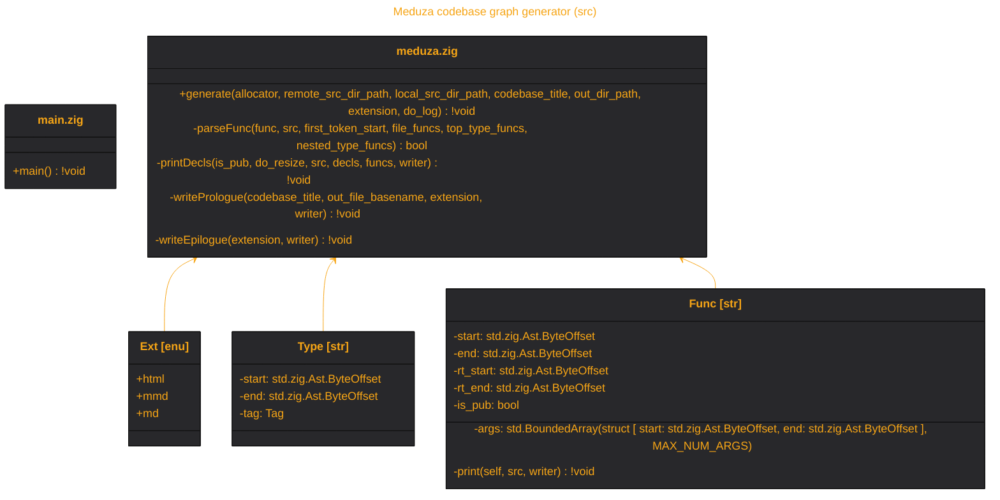

```mermaid
---
title: Meduza codebase graph generator (src)
---
%%{
    init: {
        'theme': 'base',
        'themeVariables': {
            'fontSize': '18px',
            'fontFamily': 'arial',
            'lineColor': '#F6A516',
            'primaryColor': '#28282B',
            'primaryTextColor': '#F6A516'
        }
    }
}%%
classDiagram
class `main.zig` {
    +main() !void
}
link `main.zig` "https://github.com/tensorush/meduza/blob/main/src/main.zig"
class Ext["Ext [enu]"] {
    +html
    +mmd
    +md
}
link Ext "https://github.com/tensorush/meduza/blob/main/src/meduza.zig#L18"
class Type["Type [str]"] {
    -start: std.zig.Ast.ByteOffset
    -end: std.zig.Ast.ByteOffset
    -tag: Tag
}
link Type "https://github.com/tensorush/meduza/blob/main/src/meduza.zig#L28"
class Func["Func [str]"] {
    -start: std.zig.Ast.ByteOffset
    -end: std.zig.Ast.ByteOffset
    -args: std.BoundedArray(struct [ start: std.zig.Ast.ByteOffset, end: std.zig.Ast.ByteOffset ], MAX_NUM_ARGS)
    -rt_start: std.zig.Ast.ByteOffset
    -rt_end: std.zig.Ast.ByteOffset
    -is_pub: bool
    -print(self, src, writer) !void
}
link Func "https://github.com/tensorush/meduza/blob/main/src/meduza.zig#L48"
class `meduza.zig` {
    +generate(allocator, remote_src_dir_path, local_src_dir_path, codebase_title, out_dir_path, extension, do_log) !void
    -parseFunc(func, src, first_token_start, file_funcs, top_type_funcs, nested_type_funcs) bool
    -printDecls(is_pub, do_resize, src, decls, funcs, writer) !void
    -writePrologue(codebase_title, out_file_basename, extension, writer) !void
    -writeEpilogue(extension, writer) !void
}
`meduza.zig` <-- Ext
`meduza.zig` <-- Type
`meduza.zig` <-- Func
link `meduza.zig` "https://github.com/tensorush/meduza/blob/main/src/meduza.zig"
```
