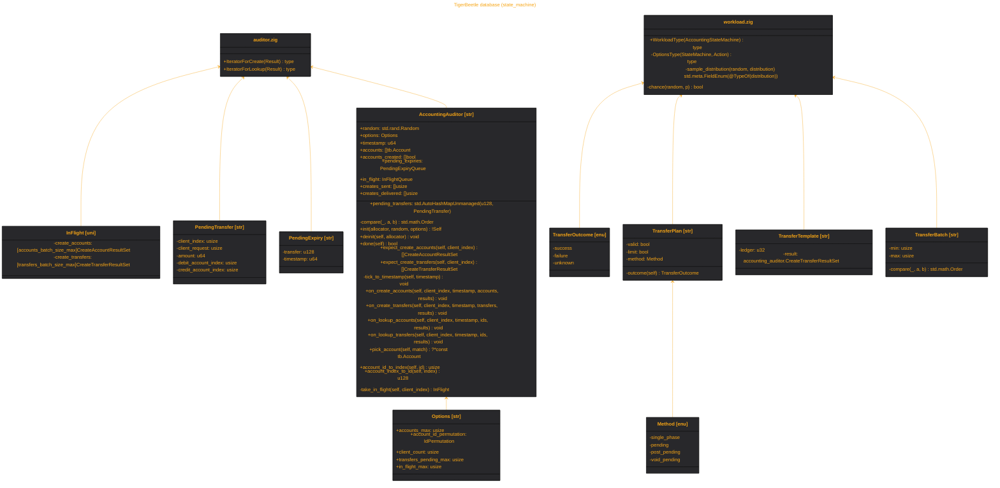

```mermaid
---
title: TigerBeetle database (state_machine)
---
%%{
    init: {
        'theme': 'base',
        'themeVariables': {
            'fontSize': '18px',
            'fontFamily': 'arial',
            'lineColor': '#F6A516',
            'primaryColor': '#28282B',
            'primaryTextColor': '#F6A516'
        }
    }
}%%
classDiagram
class InFlight["InFlight [uni]"] {
    -create_accounts: [accounts_batch_size_max]CreateAccountResultSet
    -create_transfers: [transfers_batch_size_max]CreateTransferResultSet
}
link InFlight "https://github.com/tigerbeetle/tigerbeetle/blob/main/src/state_machine/auditor.zig#L29"
class PendingTransfer["PendingTransfer [str]"] {
    -client_index: usize
    -client_request: usize
    -amount: u64
    -debit_account_index: usize
    -credit_account_index: usize
}
link PendingTransfer "https://github.com/tigerbeetle/tigerbeetle/blob/main/src/state_machine/auditor.zig#L40"
class PendingExpiry["PendingExpiry [str]"] {
    -transfer: u128
    -timestamp: u64
}
link PendingExpiry "https://github.com/tigerbeetle/tigerbeetle/blob/main/src/state_machine/auditor.zig#L46"
class Options["Options [str]"] {
    +accounts_max: usize
    +account_id_permutation: IdPermutation
    +client_count: usize
    +transfers_pending_max: usize
    +in_flight_max: usize
}
link Options "https://github.com/tigerbeetle/tigerbeetle/blob/main/src/state_machine/auditor.zig#L61"
class AccountingAuditor["AccountingAuditor [str]"] {
    +random: std.rand.Random
    +options: Options
    +timestamp: u64
    +accounts: []tb.Account
    +accounts_created: []bool
    +pending_transfers: std.AutoHashMapUnmanaged(u128, PendingTransfer)
    +pending_expiries: PendingExpiryQueue
    +in_flight: InFlightQueue
    +creates_sent: []usize
    +creates_delivered: []usize
    -compare(_, a, b) std.math.Order
    +init(allocator, random, options) !Self
    +deinit(self, allocator) void
    +done(self) bool
    +expect_create_accounts(self, client_index) []CreateAccountResultSet
    +expect_create_transfers(self, client_index) []CreateTransferResultSet
    -tick_to_timestamp(self, timestamp) void
    +on_create_accounts(self, client_index, timestamp, accounts, results) void
    +on_create_transfers(self, client_index, timestamp, transfers, results) void
    +on_lookup_accounts(self, client_index, timestamp, ids, results) void
    +on_lookup_transfers(self, client_index, timestamp, ids, results) void
    +pick_account(self, match) ?*const tb.Account
    +account_id_to_index(self, id) usize
    +account_index_to_id(self, index) u128
    -take_in_flight(self, client_index) InFlight
}
AccountingAuditor <-- Options
link AccountingAuditor "https://github.com/tigerbeetle/tigerbeetle/blob/main/src/state_machine/auditor.zig#L58"
class `auditor.zig` {
    +IteratorForCreate(Result) type
    +IteratorForLookup(Result) type
}
`auditor.zig` <-- InFlight
`auditor.zig` <-- PendingTransfer
`auditor.zig` <-- PendingExpiry
`auditor.zig` <-- AccountingAuditor
link `auditor.zig` "https://github.com/tigerbeetle/tigerbeetle/blob/main/src/state_machine/auditor.zig"
class TransferOutcome["TransferOutcome [enu]"] {
    -success
    -failure
    -unknown
}
link TransferOutcome "https://github.com/tigerbeetle/tigerbeetle/blob/main/src/state_machine/workload.zig#L34"
class Method["Method [enu]"] {
    -single_phase
    -pending
    -post_pending
    -void_pending
}
link Method "https://github.com/tigerbeetle/tigerbeetle/blob/main/src/state_machine/workload.zig#L61"
class TransferPlan["TransferPlan [str]"] {
    -valid: bool
    -limit: bool
    -method: Method
    -outcome(self) TransferOutcome
}
TransferPlan <-- Method
link TransferPlan "https://github.com/tigerbeetle/tigerbeetle/blob/main/src/state_machine/workload.zig#L48"
class TransferTemplate["TransferTemplate [str]"] {
    -ledger: u32
    -result: accounting_auditor.CreateTransferResultSet
}
link TransferTemplate "https://github.com/tigerbeetle/tigerbeetle/blob/main/src/state_machine/workload.zig#L78"
class TransferBatch["TransferBatch [str]"] {
    -min: usize
    -max: usize
    -compare(_, a, b) std.math.Order
}
link TransferBatch "https://github.com/tigerbeetle/tigerbeetle/blob/main/src/state_machine/workload.zig#L92"
class `workload.zig` {
    +WorkloadType(AccountingStateMachine) type
    -OptionsType(StateMachine, Action) type
    -sample_distribution(random, distribution) std.meta.FieldEnum(@TypeOf(distribution))
    -chance(random, p) bool
}
`workload.zig` <-- TransferOutcome
`workload.zig` <-- TransferPlan
`workload.zig` <-- TransferTemplate
`workload.zig` <-- TransferBatch
link `workload.zig` "https://github.com/tigerbeetle/tigerbeetle/blob/main/src/state_machine/workload.zig"
```
