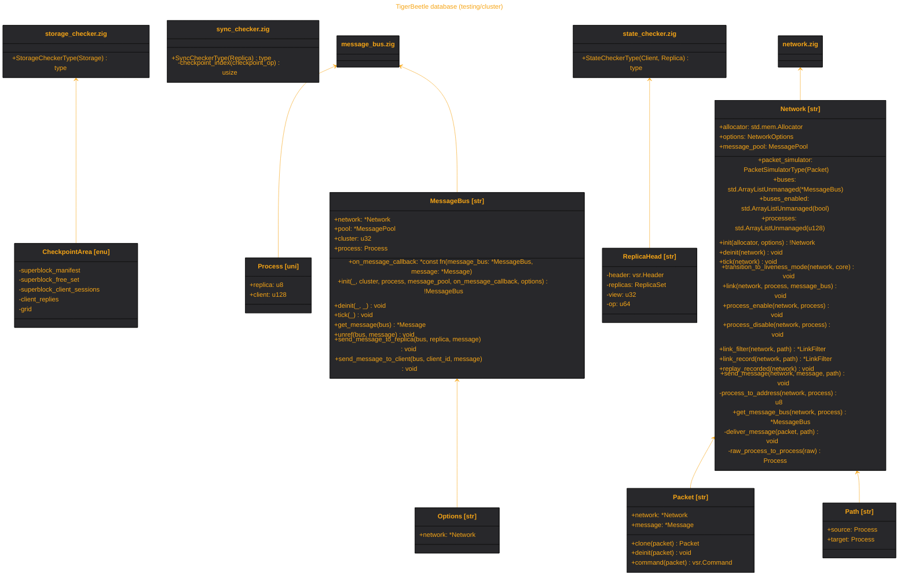

```mermaid
---
title: TigerBeetle database (testing/cluster)
---
%%{
    init: {
        'theme': 'base',
        'themeVariables': {
            'fontSize': '18px',
            'fontFamily': 'arial',
            'lineColor': '#F6A516',
            'primaryColor': '#28282B',
            'primaryTextColor': '#F6A516'
        }
    }
}%%
classDiagram
class CheckpointArea["CheckpointArea [enu]"] {
    -superblock_manifest
    -superblock_free_set
    -superblock_client_sessions
    -client_replies
    -grid
}
link CheckpointArea "https://github.com/tigerbeetle/tigerbeetle/blob/main/src/testing/cluster/storage_checker.zig#L44"
class `storage_checker.zig` {
    +StorageCheckerType(Storage) type
}
`storage_checker.zig` <-- CheckpointArea
link `storage_checker.zig` "https://github.com/tigerbeetle/tigerbeetle/blob/main/src/testing/cluster/storage_checker.zig"
class `sync_checker.zig` {
    +SyncCheckerType(Replica) type
    -checkpoint_index(checkpoint_op) usize
}
link `sync_checker.zig` "https://github.com/tigerbeetle/tigerbeetle/blob/main/src/testing/cluster/sync_checker.zig"
class Process["Process [uni]"] {
    +replica: u8
    +client: u128
}
link Process "https://github.com/tigerbeetle/tigerbeetle/blob/main/src/testing/cluster/message_bus.zig#L13"
class Options["Options [str]"] {
    +network: *Network
}
link Options "https://github.com/tigerbeetle/tigerbeetle/blob/main/src/testing/cluster/message_bus.zig#L28"
class MessageBus["MessageBus [str]"] {
    +network: *Network
    +pool: *MessagePool
    +cluster: u32
    +process: Process
    +on_message_callback: *const fn (message_bus: *MessageBus, message: *Message)
    +init(_, cluster, process, message_pool, on_message_callback, options) !MessageBus
    +deinit(_, _) void
    +tick(_) void
    +get_message(bus) *Message
    +unref(bus, message) void
    +send_message_to_replica(bus, replica, message) void
    +send_message_to_client(bus, client_id, message) void
}
MessageBus <-- Options
link MessageBus "https://github.com/tigerbeetle/tigerbeetle/blob/main/src/testing/cluster/message_bus.zig#L18"
class `message_bus.zig`
`message_bus.zig` <-- Process
`message_bus.zig` <-- MessageBus
link `message_bus.zig` "https://github.com/tigerbeetle/tigerbeetle/blob/main/src/testing/cluster/message_bus.zig"
class ReplicaHead["ReplicaHead [str]"] {
    -header: vsr.Header
    -replicas: ReplicaSet
    -view: u32
    -op: u64
}
link ReplicaHead "https://github.com/tigerbeetle/tigerbeetle/blob/main/src/testing/cluster/state_checker.zig#L18"
class `state_checker.zig` {
    +StateCheckerType(Client, Replica) type
}
`state_checker.zig` <-- ReplicaHead
link `state_checker.zig` "https://github.com/tigerbeetle/tigerbeetle/blob/main/src/testing/cluster/state_checker.zig"
class Packet["Packet [str]"] {
    +network: *Network
    +message: *Message
    +clone(packet) Packet
    +deinit(packet) void
    +command(packet) vsr.Command
}
link Packet "https://github.com/tigerbeetle/tigerbeetle/blob/main/src/testing/cluster/network.zig#L26"
class Path["Path [str]"] {
    +source: Process
    +target: Process
}
link Path "https://github.com/tigerbeetle/tigerbeetle/blob/main/src/testing/cluster/network.zig#L46"
class Network["Network [str]"] {
    +allocator: std.mem.Allocator
    +options: NetworkOptions
    +packet_simulator: PacketSimulatorType(Packet)
    +buses: std.ArrayListUnmanaged(*MessageBus)
    +buses_enabled: std.ArrayListUnmanaged(bool)
    +processes: std.ArrayListUnmanaged(u128)
    +message_pool: MessagePool
    +init(allocator, options) !Network
    +deinit(network) void
    +tick(network) void
    +transition_to_liveness_mode(network, core) void
    +link(network, process, message_bus) void
    +process_enable(network, process) void
    +process_disable(network, process) void
    +link_filter(network, path) *LinkFilter
    +link_record(network, path) *LinkFilter
    +replay_recorded(network) void
    +send_message(network, message, path) void
    -process_to_address(network, process) u8
    +get_message_bus(network, process) *MessageBus
    -deliver_message(packet, path) void
    -raw_process_to_process(raw) Process
}
Network <-- Packet
Network <-- Path
link Network "https://github.com/tigerbeetle/tigerbeetle/blob/main/src/testing/cluster/network.zig#L25"
class `network.zig`
`network.zig` <-- Network
link `network.zig` "https://github.com/tigerbeetle/tigerbeetle/blob/main/src/testing/cluster/network.zig"
```
