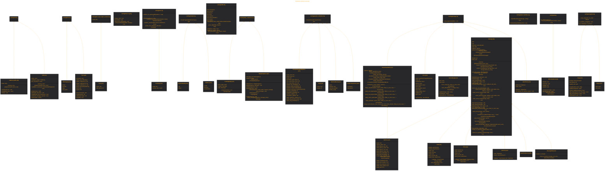

```mermaid
---
title: Tigerbeetle database (testing)
---
%%{
    init: {
        'theme': 'base',
        'themeVariables': {
            'fontSize': '18px',
            'fontFamily': 'arial',
            'lineColor': '#F6A516',
            'primaryColor': '#28282B',
            'primaryTextColor': '#F6A516'
        }
    }
}%%
classDiagram
class InMemoryAOF["InMemoryAOF [str]"] {
    -backing_store: []align(constants.sector_size)
    -index: usize
    +seekTo(self, to) !void
    +readAll(self, buf) !usize
    +close() void
}
link InMemoryAOF "https://github.com/tigerbeetle/tigerbeetle/blob/main/src/testing/aof.zig#L15"
class AOF["AOF [str]"] {
    +index: usize
    +backing_store: []align(constants.sector_size)
    +validation_target: *AOFEntry
    +last_checksum: ?u128
    +validation_checksums: std.AutoHashMap(u128, void)
    +init(allocator) !AOF
    +deinit(self, allocator) void
    +validate(self, last_checksum) !void
    +write(self, message, options) !void
    +iterator(self) Iterator
}
link AOF "https://github.com/tigerbeetle/tigerbeetle/blob/main/src/testing/aof.zig#L37"
class `testing/aof.zig`
`testing/aof.zig` <-- InMemoryAOF
`testing/aof.zig` <-- AOF
link `testing/aof.zig` "https://github.com/tigerbeetle/tigerbeetle/blob/main/src/testing/aof.zig"
class OffsetType["OffsetType [enu]"] {
    +linear
    +periodic
    +step
    +non_ideal
}
link OffsetType "https://github.com/tigerbeetle/tigerbeetle/blob/main/src/testing/time.zig#L4"
class Time["Time [str]"] {
    +resolution: u64
    +offset_type: OffsetType
    +offset_coefficient_A: i64
    +offset_coefficient_B: i64
    +offset_coefficient_C: u32
    +prng: std.rand.DefaultPrng
    +ticks: u64
    +epoch: i64
    +monotonic(self) u64
    +realtime(self) i64
    +offset(self, ticks) i64
    +tick(self) void
}
link Time "https://github.com/tigerbeetle/tigerbeetle/blob/main/src/testing/time.zig#L11"
class `testing/time.zig`
`testing/time.zig` <-- OffsetType
`testing/time.zig` <-- Time
link `testing/time.zig` "https://github.com/tigerbeetle/tigerbeetle/blob/main/src/testing/time.zig"
class Case["Case [str]"] {
    +hash: u64
    +b64: []const u8
}
link Case "https://github.com/tigerbeetle/tigerbeetle/blob/main/src/testing/low_level_hash_vectors.zig#L5"
class `testing/low_level_hash_vectors.zig` {
    +seed: u64
}
`testing/low_level_hash_vectors.zig` <-- Case
link `testing/low_level_hash_vectors.zig` "https://github.com/tigerbeetle/tigerbeetle/blob/main/src/testing/low_level_hash_vectors.zig"
class `testing/hash_log.zig` {
    -ensure_init() void
    +emit(hash) void
    -emit_never_inline(hash) void
    +emit_autohash(hashable, strategy) void
}
link `testing/hash_log.zig` "https://github.com/tigerbeetle/tigerbeetle/blob/main/src/testing/hash_log.zig"
class FuzzArgs["FuzzArgs [str]"] {
    +seed: u64
    +events_max: ?usize
}
link FuzzArgs "https://github.com/tigerbeetle/tigerbeetle/blob/main/src/testing/fuzz.zig#L70"
class `testing/fuzz.zig` {
    +random_int_exponential(random, T, avg) T
    +Distribution(Enum) type
    +random_enum_distribution(random, Enum) Distribution(Enum)
    +random_enum(random, Enum, distribution) Enum
    +parse_fuzz_args(args_allocator) !FuzzArgs
}
`testing/fuzz.zig` <-- FuzzArgs
link `testing/fuzz.zig` "https://github.com/tigerbeetle/tigerbeetle/blob/main/src/testing/fuzz.zig"
class ReplicaHealth["ReplicaHealth [enu]"] {
    +up
    +down
}
link ReplicaHealth "https://github.com/tigerbeetle/tigerbeetle/blob/main/src/testing/cluster.zig#L29"
class Failure["Failure [enu]"] {
    +crash
    +liveness
    +correctness
}
link Failure "https://github.com/tigerbeetle/tigerbeetle/blob/main/src/testing/cluster.zig#L34"
class `testing/cluster.zig` {
    +ClusterType(StateMachineType) type
}
`testing/cluster.zig` <-- ReplicaHealth
`testing/cluster.zig` <-- Failure
link `testing/cluster.zig` "https://github.com/tigerbeetle/tigerbeetle/blob/main/src/testing/cluster.zig"
class `testing/table.zig` {
    test "comment"()
    test "enum"()
    test "bool"()
    test "int"()
    test "struct"()
    test "struct (nested)"()
    test "array"()
    test "union"()
    +parse(Row, table_string) std.BoundedArray(Row, 128)
    -parse_data(Data, tokens) Data
    -eat(tokens, token) bool
    -field(Enum, name) Enum
    -test_parse(Row, rows_expect, string) !void
}
link `testing/table.zig` "https://github.com/tigerbeetle/tigerbeetle/blob/main/src/testing/table.zig"
class PendingReply["PendingReply [str]"] {
    -client_index: usize
    -request: *Message
    -reply: *Message
    -compare(context, a, b) std.math.Order
}
link PendingReply "https://github.com/tigerbeetle/tigerbeetle/blob/main/src/testing/reply_sequence.zig#L18"
class ReplySequence["ReplySequence [str]"] {
    +message_pool: MessagePool
    +stalled_op: u64
    +stalled_queue: PendingReplyQueue
    +init(allocator) !ReplySequence
    +deinit(sequence, allocator) void
    +empty(sequence) bool
    +free(sequence) usize
    +insert(sequence, client_index, request_message, reply_message) void
    +peek(sequence) ?PendingReply
    +next(sequence) void
    -clone_message(sequence, message_client) *Message
}
link ReplySequence "https://github.com/tigerbeetle/tigerbeetle/blob/main/src/testing/reply_sequence.zig#L32"
class `testing/reply_sequence.zig`
`testing/reply_sequence.zig` <-- PendingReply
`testing/reply_sequence.zig` <-- ReplySequence
link `testing/reply_sequence.zig` "https://github.com/tigerbeetle/tigerbeetle/blob/main/src/testing/reply_sequence.zig"
class PacketSimulatorOptions["PacketSimulatorOptions [str]"] {
    +node_count: u8
    +client_count: u8
    +seed: u64
    +recorded_count_max: u8
    +one_way_delay_mean: u64
    +one_way_delay_min: u64
    +packet_loss_probability: u8
    +packet_replay_probability: u8
    +partition_mode: PartitionMode
    +partition_symmetry: PartitionSymmetry
    +partition_probability: u8
    +unpartition_probability: u8
    +partition_stability: u32
    +unpartition_stability: u32
    +path_maximum_capacity: u8
    +path_clog_duration_mean: u64
    +path_clog_probability: u8
}
link PacketSimulatorOptions "https://github.com/tigerbeetle/tigerbeetle/blob/main/src/testing/packet_simulator.zig#L10"
class Path["Path [str]"] {
    +source: u8
    +target: u8
}
link Path "https://github.com/tigerbeetle/tigerbeetle/blob/main/src/testing/packet_simulator.zig#L49"
class PartitionMode["PartitionMode [enu]"] {
    +none
    +uniform_size
    +uniform_partition
    +isolate_single
}
link PartitionMode "https://github.com/tigerbeetle/tigerbeetle/blob/main/src/testing/packet_simulator.zig#L61"
class PartitionSymmetry["PartitionSymmetry [enu]"] {
    +symmetric
    +asymmetric
}
link PartitionSymmetry "https://github.com/tigerbeetle/tigerbeetle/blob/main/src/testing/packet_simulator.zig#L77"
class `testing/packet_simulator.zig` {
    +PacketSimulatorType(Packet) type
}
`testing/packet_simulator.zig` <-- PacketSimulatorOptions
`testing/packet_simulator.zig` <-- Path
`testing/packet_simulator.zig` <-- PartitionMode
`testing/packet_simulator.zig` <-- PartitionSymmetry
link `testing/packet_simulator.zig` "https://github.com/tigerbeetle/tigerbeetle/blob/main/src/testing/packet_simulator.zig"
class Options["Options [str]"] {
    +seed: u64
    +replica_index: ?u8
    +read_latency_min: u64
    +read_latency_mean: u64
    +write_latency_min: u64
    +write_latency_mean: u64
    +read_fault_probability: u8
    +write_fault_probability: u8
    +crash_fault_probability: u8
    +fault_atlas: ?*const ClusterFaultAtlas
}
link Options "https://github.com/tigerbeetle/tigerbeetle/blob/main/src/testing/storage.zig#L56"
class Read["Read [str]"] {
    +always_synchronous
    +always_asynchronous
    +callback: *const fn (read: *Storage.Read)
    +buffer: []u8
    +zone: vsr.Zone
    +offset: u64
    +done_at_tick: u64
    +stack_trace: StackTrace
    -less_than(context, a, b) math.Order
}
link Read "https://github.com/tigerbeetle/tigerbeetle/blob/main/src/testing/storage.zig#L94"
class Write["Write [str]"] {
    +callback: *const fn (write: *Storage.Write)
    +buffer: []const u8
    +zone: vsr.Zone
    +offset: u64
    +done_at_tick: u64
    +stack_trace: StackTrace
    -less_than(context, a, b) math.Order
}
link Write "https://github.com/tigerbeetle/tigerbeetle/blob/main/src/testing/storage.zig#L111"
class NextTick["NextTick [str]"] {
    +next: ?*NextTick
    +source: NextTickSource
    +callback: *const fn (next_tick: *NextTick)
}
link NextTick "https://github.com/tigerbeetle/tigerbeetle/blob/main/src/testing/storage.zig#L128"
class NextTickSource["NextTickSource [enu]"]
link NextTickSource "https://github.com/tigerbeetle/tigerbeetle/blob/main/src/testing/storage.zig#L134"
class MessageRaw["MessageRaw [str]"] {
    -header: vsr.Header
    -body: [constants.message_size_max - @sizeOf(vsr.Header)
}
link MessageRaw "https://github.com/tigerbeetle/tigerbeetle/blob/main/src/testing/storage.zig#L524"
class Storage["Storage [str]"] {
    +lsm
    +vsr
    +allocator: mem.Allocator
    +size: u64
    +options: Options
    +prng: std.rand.DefaultPrng
    +memory: []align(constants.sector_size)
    +memory_written: std.DynamicBitSetUnmanaged
    +faults: std.DynamicBitSetUnmanaged
    +faulty: bool
    +reads: PriorityQueue(*Storage.Read, void, Storage.Read.less_than)
    +writes: PriorityQueue(*Storage.Write, void, Storage.Write.less_than)
    +ticks: u64
    +next_tick_queue: FIFO(NextTick)
    +init(allocator, size, options) !Storage
    +deinit(storage, allocator) void
    +reset(storage) void
    +size_used(storage) usize
    +copy(storage, origin) void
    +tick(storage) void
    +on_next_tick(storage, source, callback, next_tick) void
    +reset_next_tick_lsm(storage) void
    +read_sectors(storage, callback, read, buffer, zone, offset_in_zone) void
    -read_sectors_finish(storage, read) void
    +write_sectors(storage, callback, write, buffer, zone, offset_in_zone) void
    -write_sectors_finish(storage, write) void
    -read_latency(storage) u64
    -write_latency(storage) u64
    -latency(storage, min, mean) u64
    -x_in_100(storage, x) bool
    -fault_faulty_sectors(storage, zone, offset_in_zone, size) void
    -fault_sector(storage, zone, sector) void
    +superblock_header(storage, copy_) *const superblock.SuperBlockHeader
    +wal_headers(storage) []const vsr.Header
    +wal_prepares(storage) []const MessageRaw
    +grid_block(storage, address) *align(constants.sector_size) [constants.block_size]u8
    +log_pending_io(storage) void
    +assert_no_pending_reads(storage, zone) void
    +assert_no_pending_writes(storage, zone) void
}
Storage <-- Options
Storage <-- Read
Storage <-- Write
Storage <-- NextTick
Storage <-- NextTickSource
Storage <-- MessageRaw
link Storage "https://github.com/tigerbeetle/tigerbeetle/blob/main/src/testing/storage.zig#L54"
class Area["Area [uni]"] {
    +zone: superblock.SuperBlockZone
    +copy: u8
    +superblock: struct
    +sector: usize
    +wal_headers: struct
    +slot: usize
    +wal_prepares: struct
    +slot: usize
    +client_replies: struct
    +address: u64
    +grid: struct
    -sectors(area) SectorRange
}
link Area "https://github.com/tigerbeetle/tigerbeetle/blob/main/src/testing/storage.zig#L617"
class SectorRange["SectorRange [str]"] {
    -min: usize
    -max: usize
    -from_zone(zone, offset_in_zone, size) SectorRange
    -from_offset(offset_in_storage, size) SectorRange
    -random(range, rand) usize
    -next(range) ?usize
    -intersect(a, b) ?SectorRange
}
link SectorRange "https://github.com/tigerbeetle/tigerbeetle/blob/main/src/testing/storage.zig#L655"
class Options["Options [str]"] {
    +faulty_superblock: bool
    +faulty_wal_headers: bool
    +faulty_wal_prepares: bool
    +faulty_client_replies: bool
    +faulty_grid: bool
}
link Options "https://github.com/tigerbeetle/tigerbeetle/blob/main/src/testing/storage.zig#L702"
class ClusterFaultAtlas["ClusterFaultAtlas [str]"] {
    +options: Options
    +faulty_superblock_areas: FaultySuperBlockAreas
    +faulty_wal_header_sectors: [constants.members_max]FaultyWALHeaders
    +faulty_client_reply_slots: [constants.members_max]FaultyClientReplies
    +faulty_grid_blocks: [constants.members_max]FaultyGridBlocks
    +init(replica_count, random, options) ClusterFaultAtlas
    -faulty_superblock(atlas, replica_index, offset_in_zone, size) ?SectorRange
    -faulty_wal_headers(atlas, replica_index, offset_in_zone, size) ?SectorRange
    -faulty_wal_prepares(atlas, replica_index, offset_in_zone, size) ?SectorRange
    -faulty_client_replies(atlas, replica_index, offset_in_zone, size) ?SectorRange
    -faulty_grid(atlas, replica_index, offset_in_zone, size) ?SectorRange
    -faulty_sectors(chunk_count, chunk_size, zone, faulty_chunks, offset_in_zone, size) ?SectorRange
}
ClusterFaultAtlas <-- Options
link ClusterFaultAtlas "https://github.com/tigerbeetle/tigerbeetle/blob/main/src/testing/storage.zig#L701"
class StackTrace["StackTrace [str]"] {
    -addresses: [64]usize
    -index: usize
    -capture() StackTrace
    +format(self, fmt, options, writer) !void
}
link StackTrace "https://github.com/tigerbeetle/tigerbeetle/blob/main/src/testing/storage.zig#L949"
class `testing/storage.zig` {
    -verify_alignment(buffer) void
}
`testing/storage.zig` <-- Storage
`testing/storage.zig` <-- Area
`testing/storage.zig` <-- SectorRange
`testing/storage.zig` <-- ClusterFaultAtlas
`testing/storage.zig` <-- StackTrace
link `testing/storage.zig` "https://github.com/tigerbeetle/tigerbeetle/blob/main/src/testing/storage.zig"
class `testing/state_machine.zig` {
    +StateMachineType(Storage, config) type
    -WorkloadType(StateMachine) type
}
link `testing/state_machine.zig` "https://github.com/tigerbeetle/tigerbeetle/blob/main/src/testing/state_machine.zig"
class IdPermutation["IdPermutation [uni]"] {
    +identity: void
    +inversion: void
    +zigzag: void
    +random: u64
    +encode(self, data) u128
    +decode(self, id) usize
    +generate(random) IdPermutation
}
link IdPermutation "https://github.com/tigerbeetle/tigerbeetle/blob/main/src/testing/id.zig#L8"
class `testing/id.zig` {
    test "IdPermutation"()
    -test_id_permutation(permutation, value) !void
}
`testing/id.zig` <-- IdPermutation
link `testing/id.zig` "https://github.com/tigerbeetle/tigerbeetle/blob/main/src/testing/id.zig"
class Snap["Snap [str]"] {
    +location: SourceLocation
    +text: []const u8
    +update_this: bool
    +snap(location, text) Snap
    +update(snapshot) Snap
    -should_update(snapshot) bool
    +diff_fmt(snapshot, fmt, fmt_args) !void
    +diff_json(snapshot, value) !void
    +diff(snapshot, got) !void
}
link Snap "https://github.com/tigerbeetle/tigerbeetle/blob/main/src/testing/snaptest.zig#L62"
class Range["Range [str]"] {
    -start: usize
    -end: usize
}
link Range "https://github.com/tigerbeetle/tigerbeetle/blob/main/src/testing/snaptest.zig#L179"
class `testing/snaptest.zig` {
    -snap_range(text, src_line) Range
    -is_multiline_string(line) bool
    -get_indent(line) []const u8
}
`testing/snaptest.zig` <-- Snap
`testing/snaptest.zig` <-- Range
link `testing/snaptest.zig` "https://github.com/tigerbeetle/tigerbeetle/blob/main/src/testing/snaptest.zig"
```
