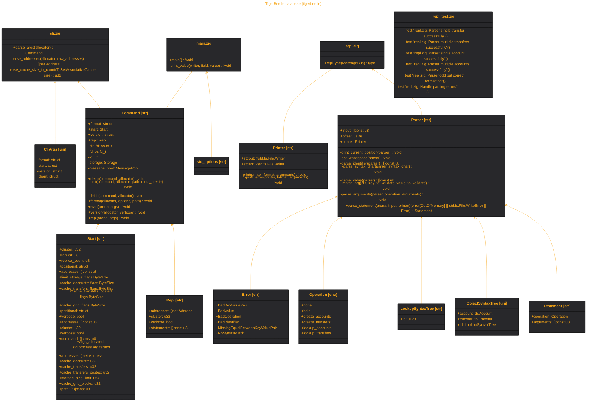

```mermaid
---
title: TigerBeetle database (tigerbeetle)
---
%%{
    init: {
        'theme': 'base',
        'themeVariables': {
            'fontSize': '18px',
            'fontFamily': 'arial',
            'lineColor': '#F6A516',
            'primaryColor': '#28282B',
            'primaryTextColor': '#F6A516'
        }
    }
}%%
classDiagram
class CliArgs["CliArgs [uni]"] {
    -format: struct
    -start: struct
    -version: struct
    -client: struct
}
link CliArgs "https://github.com/tigerbeetle/tigerbeetle/blob/main/src/tigerbeetle/cli.zig#L17"
class Start["Start [str]"] {
    +cluster: u32
    +replica: u8
    +replica_count: u8
    +positional: struct
    +addresses: []const u8
    +limit_storage: flags.ByteSize
    +cache_accounts: flags.ByteSize
    +cache_transfers: flags.ByteSize
    +cache_transfers_posted: flags.ByteSize
    +cache_grid: flags.ByteSize
    +positional: struct
    +verbose: bool
    +addresses: []const u8
    +cluster: u32
    +verbose: bool
    +command: []const u8
    +args_allocated: std.process.ArgIterator
    +addresses: []net.Address
    +cache_accounts: u32
    +cache_transfers: u32
    +cache_transfers_posted: u32
    +storage_size_limit: u64
    +cache_grid_blocks: u32
    +path: [:0]const u8
}
link Start "https://github.com/tigerbeetle/tigerbeetle/blob/main/src/tigerbeetle/cli.zig#L136"
class Repl["Repl [str]"] {
    +addresses: []net.Address
    +cluster: u32
    +verbose: bool
    +statements: []const u8
}
link Repl "https://github.com/tigerbeetle/tigerbeetle/blob/main/src/tigerbeetle/cli.zig#L147"
class Command["Command [uni]"] {
    +format: struct
    +start: Start
    +version: struct
    +repl: Repl
    +deinit(command, allocator) void
}
Command <-- Start
Command <-- Repl
link Command "https://github.com/tigerbeetle/tigerbeetle/blob/main/src/tigerbeetle/cli.zig#L135"
class `cli.zig` {
    +parse_args(allocator) !Command
    -parse_addresses(allocator, raw_addresses) []net.Address
    -parse_cache_size_to_count(T, SetAssociativeCache, size) u32
}
`cli.zig` <-- CliArgs
`cli.zig` <-- Command
link `cli.zig` "https://github.com/tigerbeetle/tigerbeetle/blob/main/src/tigerbeetle/cli.zig"
class std_options["std_options [str]"]
link std_options "https://github.com/tigerbeetle/tigerbeetle/blob/main/src/tigerbeetle/main.zig#L36"
class Command["Command [str]"] {
    -dir_fd: os.fd_t
    -fd: os.fd_t
    -io: IO
    -storage: Storage
    -message_pool: MessagePool
    -init(command, allocator, path, must_create) !void
    -deinit(command, allocator) void
    +format(allocator, options, path) !void
    +start(arena, args) !void
    +version(allocator, verbose) !void
    +repl(arena, args) !void
}
link Command "https://github.com/tigerbeetle/tigerbeetle/blob/main/src/tigerbeetle/main.zig#L69"
class `main.zig` {
    +main() !void
    -print_value(writer, field, value) !void
}
`main.zig` <-- std_options
`main.zig` <-- Command
link `main.zig` "https://github.com/tigerbeetle/tigerbeetle/blob/main/src/tigerbeetle/main.zig"
class Printer["Printer [str]"] {
    +stdout: ?std.fs.File.Writer
    +stderr: ?std.fs.File.Writer
    -print(printer, format, arguments) !void
    -print_error(printer, format, arguments) !void
}
link Printer "https://github.com/tigerbeetle/tigerbeetle/blob/main/src/tigerbeetle/repl.zig#L24"
class Error["Error [err]"] {
    +BadKeyValuePair
    +BadValue
    +BadOperation
    +BadIdentifier
    +MissingEqualBetweenKeyValuePair
    +NoSyntaxMatch
}
link Error "https://github.com/tigerbeetle/tigerbeetle/blob/main/src/tigerbeetle/repl.zig#L46"
class Operation["Operation [enu]"] {
    +none
    +help
    +create_accounts
    +create_transfers
    +lookup_accounts
    +lookup_transfers
}
link Operation "https://github.com/tigerbeetle/tigerbeetle/blob/main/src/tigerbeetle/repl.zig#L55"
class LookupSyntaxTree["LookupSyntaxTree [str]"] {
    +id: u128
}
link LookupSyntaxTree "https://github.com/tigerbeetle/tigerbeetle/blob/main/src/tigerbeetle/repl.zig#L64"
class ObjectSyntaxTree["ObjectSyntaxTree [uni]"] {
    +account: tb.Account
    +transfer: tb.Transfer
    +id: LookupSyntaxTree
}
link ObjectSyntaxTree "https://github.com/tigerbeetle/tigerbeetle/blob/main/src/tigerbeetle/repl.zig#L68"
class Statement["Statement [str]"] {
    +operation: Operation
    +arguments: []const u8
}
link Statement "https://github.com/tigerbeetle/tigerbeetle/blob/main/src/tigerbeetle/repl.zig#L74"
class Parser["Parser [str]"] {
    +input: []const u8
    +offset: usize
    +printer: Printer
    -print_current_position(parser) !void
    -eat_whitespace(parser) void
    -parse_identifier(parser) []const u8
    -parse_syntax_char(parser, syntax_char) !void
    -parse_value(parser) []const u8
    -match_arg(out, key_to_validate, value_to_validate) !void
    -parse_arguments(parser, operation, arguments) !void
    +parse_statement(arena, input, printer) (error[OutOfMemory] || std.fs.File.WriteError || Error)!Statement
}
Parser <-- Error
Parser <-- Operation
Parser <-- LookupSyntaxTree
Parser <-- ObjectSyntaxTree
Parser <-- Statement
link Parser "https://github.com/tigerbeetle/tigerbeetle/blob/main/src/tigerbeetle/repl.zig#L41"
class `repl.zig` {
    +ReplType(MessageBus) type
}
`repl.zig` <-- Printer
`repl.zig` <-- Parser
link `repl.zig` "https://github.com/tigerbeetle/tigerbeetle/blob/main/src/tigerbeetle/repl.zig"
class `repl_test.zig` {
    test "repl.zig: Parser single transfer successfully"()
    test "repl.zig: Parser multiple transfers successfully"()
    test "repl.zig: Parser single account successfully"()
    test "repl.zig: Parser multiple accounts successfully"()
    test "repl.zig: Parser odd but correct formatting"()
    test "repl.zig: Handle parsing errors"()
}
link `repl_test.zig` "https://github.com/tigerbeetle/tigerbeetle/blob/main/src/tigerbeetle/repl_test.zig"
```
