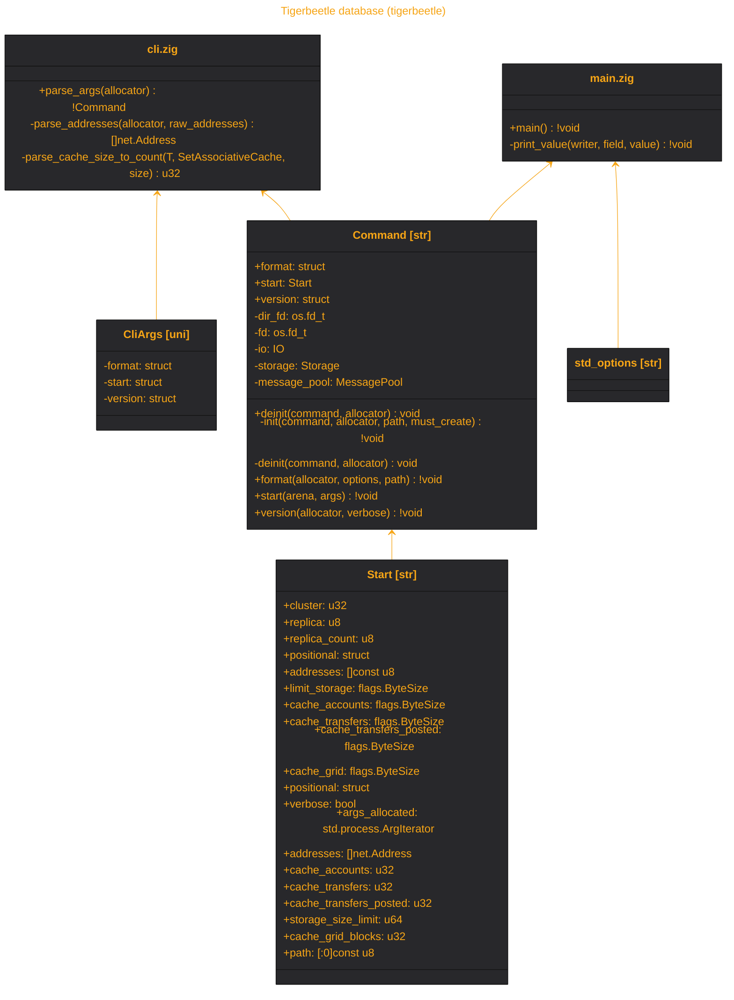

```mermaid
---
title: Tigerbeetle database (tigerbeetle)
---
%%{
    init: {
        'theme': 'base',
        'themeVariables': {
            'fontSize': '18px',
            'fontFamily': 'arial',
            'lineColor': '#F6A516',
            'primaryColor': '#28282B',
            'primaryTextColor': '#F6A516'
        }
    }
}%%
classDiagram
class CliArgs["CliArgs [uni]"] {
    -format: struct
    -start: struct
    -version: struct
}
link CliArgs "https://github.com/tigerbeetle/tigerbeetle/blob/main/src/tigerbeetle/cli.zig#L17"
class Start["Start [str]"] {
    +cluster: u32
    +replica: u8
    +replica_count: u8
    +positional: struct
    +addresses: []const u8
    +limit_storage: flags.ByteSize
    +cache_accounts: flags.ByteSize
    +cache_transfers: flags.ByteSize
    +cache_transfers_posted: flags.ByteSize
    +cache_grid: flags.ByteSize
    +positional: struct
    +verbose: bool
    +args_allocated: std.process.ArgIterator
    +addresses: []net.Address
    +cache_accounts: u32
    +cache_transfers: u32
    +cache_transfers_posted: u32
    +storage_size_limit: u64
    +cache_grid_blocks: u32
    +path: [:0]const u8
}
link Start "https://github.com/tigerbeetle/tigerbeetle/blob/main/src/tigerbeetle/cli.zig#L123"
class Command["Command [uni]"] {
    +format: struct
    +start: Start
    +version: struct
    +deinit(command, allocator) void
}
Command <-- Start
link Command "https://github.com/tigerbeetle/tigerbeetle/blob/main/src/tigerbeetle/cli.zig#L122"
class `cli.zig` {
    +parse_args(allocator) !Command
    -parse_addresses(allocator, raw_addresses) []net.Address
    -parse_cache_size_to_count(T, SetAssociativeCache, size) u32
}
`cli.zig` <-- CliArgs
`cli.zig` <-- Command
link `cli.zig` "https://github.com/tigerbeetle/tigerbeetle/blob/main/src/tigerbeetle/cli.zig"
class std_options["std_options [str]"]
link std_options "https://github.com/tigerbeetle/tigerbeetle/blob/main/src/tigerbeetle/main.zig#L34"
class Command["Command [str]"] {
    -dir_fd: os.fd_t
    -fd: os.fd_t
    -io: IO
    -storage: Storage
    -message_pool: MessagePool
    -init(command, allocator, path, must_create) !void
    -deinit(command, allocator) void
    +format(allocator, options, path) !void
    +start(arena, args) !void
    +version(allocator, verbose) !void
}
link Command "https://github.com/tigerbeetle/tigerbeetle/blob/main/src/tigerbeetle/main.zig#L66"
class `main.zig` {
    +main() !void
    -print_value(writer, field, value) !void
}
`main.zig` <-- std_options
`main.zig` <-- Command
link `main.zig` "https://github.com/tigerbeetle/tigerbeetle/blob/main/src/tigerbeetle/main.zig"
```
