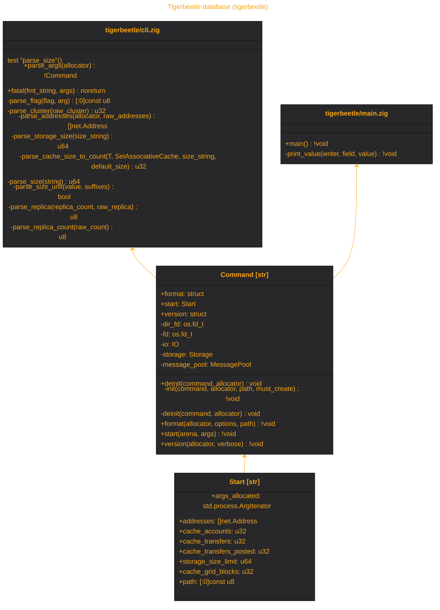

```mermaid
---
title: Tigerbeetle database (tigerbeetle)
---
%%{
    init: {
        'theme': 'base',
        'themeVariables': {
            'fontSize': '18px',
            'fontFamily': 'arial',
            'lineColor': '#F6A516',
            'primaryColor': '#28282B',
            'primaryTextColor': '#F6A516'
        }
    }
}%%
classDiagram
class Start["Start [str]"] {
    +args_allocated: std.process.ArgIterator
    +addresses: []net.Address
    +cache_accounts: u32
    +cache_transfers: u32
    +cache_transfers_posted: u32
    +storage_size_limit: u64
    +cache_grid_blocks: u32
    +path: [:0]const u8
}
link Start "https://github.com/tigerbeetle/tigerbeetle/blob/main/src/tigerbeetle/cli.zig#L97"
class Command["Command [uni]"] {
    +format: struct
    +start: Start
    +version: struct
    +deinit(command, allocator) void
}
Command <-- Start
link Command "https://github.com/tigerbeetle/tigerbeetle/blob/main/src/tigerbeetle/cli.zig#L96"
class `tigerbeetle/cli.zig` {
    test "parse_size"()
    +parse_args(allocator) !Command
    +fatal(fmt_string, args) noreturn
    -parse_flag(flag, arg) [:0]const u8
    -parse_cluster(raw_cluster) u32
    -parse_addresses(allocator, raw_addresses) []net.Address
    -parse_storage_size(size_string) u64
    -parse_cache_size_to_count(T, SetAssociativeCache, size_string, default_size) u32
    -parse_size(string) u64
    -parse_size_unit(value, suffixes) bool
    -parse_replica(replica_count, raw_replica) u8
    -parse_replica_count(raw_count) u8
}
`tigerbeetle/cli.zig` <-- Command
link `tigerbeetle/cli.zig` "https://github.com/tigerbeetle/tigerbeetle/blob/main/src/tigerbeetle/cli.zig"
class Command["Command [str]"] {
    -dir_fd: os.fd_t
    -fd: os.fd_t
    -io: IO
    -storage: Storage
    -message_pool: MessagePool
    -init(command, allocator, path, must_create) !void
    -deinit(command, allocator) void
    +format(allocator, options, path) !void
    +start(arena, args) !void
    +version(allocator, verbose) !void
}
link Command "https://github.com/tigerbeetle/tigerbeetle/blob/main/src/tigerbeetle/main.zig#L64"
class `tigerbeetle/main.zig` {
    +main() !void
    -print_value(writer, field, value) !void
}
`tigerbeetle/main.zig` <-- Command
link `tigerbeetle/main.zig` "https://github.com/tigerbeetle/tigerbeetle/blob/main/src/tigerbeetle/main.zig"
```
